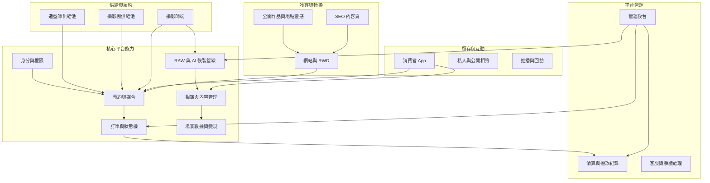
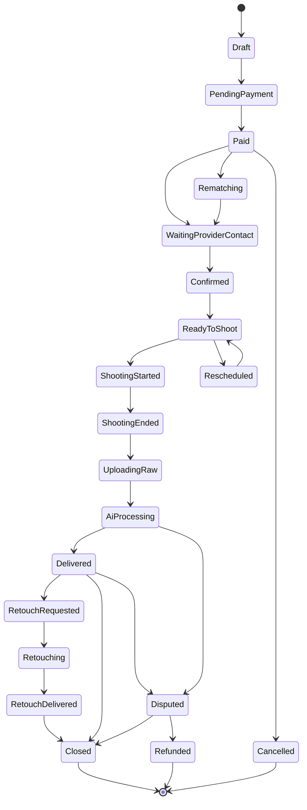

# WanderLens 完整產品架構文件

本文件把 WanderLens 定義為「網站獲客、App 留存、服務履約、內容資產、數據變現」共同構成的平台，而不是單純的攝影媒合 App。核心設計前提為：網站是首次接觸與轉換入口，App 是影像留存與回訪主場，RAW 檔案由平台雲端留存，金流採一般電商收款與後台清算，公開照片以鼓勵而非強迫的方式形成內容平台。

## 1. 平台定位

WanderLens 的產品結構分成三層價值：

| 價值層 | 產品承載 | 主要目標 |
| --- | --- | --- |
| 服務層 | 網站預約、App 預約、攝影師端、營運後台 | 產生真實訂單、完成拍攝與交付 |
| 內容層 | App 相簿、公開作品頁、地點靈感頁、攝影師作品集 | 讓照片成為可回訪、可分享、可被搜尋的內容資產 |
| 數據層 | 場景標籤、用戶行為、分享事件、加購事件、聯盟行銷對接 | 把拍攝場景轉化為廣告與聯盟行銷資產 |

平台真正的產品主張不是「找到攝影師」而已，而是讓使用者從搜尋、下單、拍攝、交付、精修、分享、公開、回訪到再次下單，都在同一個體系中自然完成。

## 2. 產品端分工

| 端點 | 核心角色 | 主要功能 | 不承擔的角色 |
| --- | --- | --- | --- |
| 網站與 RWD | 獲客入口、SEO 內容池、首次下單轉換 | 服務介紹、公開作品頁、地點靈感頁、攝影師作品頁、服務類型頁、預約下單 | 不作為深度留存主場 |
| iOS App | 內容留存與回訪引擎 | 相簿瀏覽、精修選片、分享、拍攝歷程、推播召回、再次預約 | 不作為主要 SEO 獲客入口 |
| Android App | 中長期補齊留存端 | 與 iOS App 功能一致 | 初期可不作為第一優先，但資料模型需支援 |
| 攝影師端 | 供給管理與履約工具 | 檔期管理、接案通知、拍攝節點、RAW 上傳、作品集管理、收益查看 | 不處理後製調色 |
| 營運後台 | 服務品質、供給、清算與客服控制台 | 訂單監控、檔案驗收、AI 後製狀態、精修外包工單、攝影師審核、清算撥款紀錄、客服處理 | 不替代消費者或攝影師前台體驗 |
| 外包修圖入口 | 精修工單協作 | 接收指定 RAW、下載素材、上傳精修成品、回報狀態 | 初期可不獨立平台化，以後台與人工流程承接 |
| 數據與變現後台 | 場景數據與商業合作管理 | 場景標籤、公開內容表現、分享轉換、聯盟行銷夥伴、素材授權狀態 | 不在早期承擔廣告投放全功能 |

## 3. 高層架構

## 4. 核心平台模組

### 4.1 身分與權限

角色需至少包含消費者、攝影師、造型師、攝影棚管理者、平台營運、客服、財務、外包修圖公司、商業合作夥伴。每個角色不只是登入身分，也對應不同資料可見範圍，例如消費者只看自己的私人相簿，攝影師可看自己承接訂單與獲授權公開作品，外包修圖公司只看被派工的素材與規格。

### 4.2 預約與媒合

媒合引擎以「時間優先、即時可訂」為核心。系統依拍攝類型自動帶入建議配置，再依地點、日期、時段、供給池能力、行事曆、價格與評分產生可選清單。消費者看到的攝影師、攝影棚與造型師都必須是該時段確定可用的供給。

三個供給池的媒合邏輯需彼此獨立但可交集：

| 供給池 | 條件 | 特殊邏輯 |
| --- | --- | --- |
| 攝影師 | 分區、拍攝類型能力、檔期、評分、作品集、價格 | 主供給，所有訂單必選 |
| 攝影棚 | 地點、檔期、棚型、可容納服務類型、價格 | 只在棚拍或外拍加棚拍時出現 |
| 造型師 | 檔期、服務區、作品集、價格 | 需自動計算拍攝前置妝髮緩衝 |

### 4.3 訂單與狀態機

訂單狀態需完整覆蓋服務生命週期，而不是只有「已付款 / 已完成」。

狀態機必須支援以下流程節點：

- 付款後等待攝影師於接案後 24 小時內主動聯繫。
- 聯繫完成後進入等待拍攝的中間狀態，承接可能的改期或臨時換人。
- 拍攝當天起拍、加時申請（含消費者同意與即時加價金流）、結束三個時間戳記。
- 拍攝後 RAW 上傳期限、AI 基本交付期限、精修工單與結案撥款。
- 爭議與退款流程，作為服務品質與金流爭議的最終出口。

狀態機需與攝影師棄權的分級懲罰機制連動：未在期限內聯繫或上傳，依平台規則對攝影師記錄違規，分為警告、暫停接案、永久下架三級。

### 4.4 RAW 與 AI 後製管線

平台收 RAW 是完整模式的重要前提。RAW 儲存不是主要限制，但攝影師端上傳體驗、營運可視性與管線可靠度必須被當成核心產品能力。

RAW 管線需包含：

- 大檔案分段上傳與斷點續傳。
- 攝影師端背景上傳、網路中斷恢復、上傳隊列管理。
- 機身 JPEG 快路徑：相機同時拍 RAW 與 JPEG，攝影師可優先上傳 JPEG 給 AI 調色，讓相簿盡早上架，RAW 則背景上傳供精修使用，避免 48 小時交付 SLA 被大檔上傳卡住。
- 上傳批次與檔案完整性驗收（檔案數、容量、格式、可解碼性）。
- RAW 原始檔、機身 JPEG、AI 基本調色輸出、精修輸出多版本的關聯。
- 自動產生預覽圖與相簿縮圖。
- AI 處理狀態、失敗重試、48 小時交付 SLA 倒數與告警。
- RAW 儲存週期（建議交付後最少 30 天）與精修保留延長規則。
- 指定照片精修時，外包公司可取得對應 RAW 與修圖規範，不開放整份訂單。

### 4.5 相簿與內容管理

相簿分為私人相簿與公開內容。私人相簿是 App 留存主場，公開內容則供網站 SEO、攝影師作品集、地點靈感頁與未來變現使用。

每張照片需至少具備以下資料：

| 資料類型 | 欄位示例 | 用途 |
| --- | --- | --- |
| 所屬關係 | 訂單、相簿、使用者、攝影師 | 權限與回訪 |
| 版本 | RAW、AI 基本調色、精修成品 | 交付與加購 |
| 場景 | 拍攝類型、地點、日期、城市、季節 | SEO 與聯盟行銷 |
| 授權 | 私密、連結分享、公開、可作攝影師作品集、可作平台行銷 | 內容平台與法務 |
| 行為 | 瀏覽、下載、分享、收藏、精修選片 | 留存與變現 |

### 4.6 數據與變現

數據平台不是後期報表，而是從第一天就要沉澱的資料資產。早期不必建完整廣告系統，但必須讓場景標籤、公開內容、分享行為、加購行為與回訪行為可以被記錄。

變現能力可分三層：

| 層級 | 能力 | 何時發揮 |
| --- | --- | --- |
| 內容曝光 | 公開作品頁、地點靈感頁、攝影師作品集 | 從網站獲客期開始 |
| 行為洞察 | 分享轉換、公開率、加購率、回訪率、熱門地點 | 平台化階段 |
| 商業對接 | 聯盟行銷、場景廣告、品牌合作、海外市場訊號 | 成熟期 |

## 5. 主要資料物件

| 物件 | 說明 |
| --- | --- |
| User | 消費者基本資料、偏好、拍攝歷程、相簿權限 |
| Provider | 攝影師、造型師、攝影棚等供給方 |
| Availability | 供給方可接案時段、封鎖時段、緩衝時段 |
| ServiceType | 個人寫真、家庭、寶寶、婚禮、旅拍、空間等拍攝類型 |
| Configuration | 外拍、棚拍、單機、雙機、造型師等配置 |
| Booking | 預約條件、候選供給、價格、付款狀態 |
| Order | 已成立服務案件與狀態機 |
| ShootEvent | 起拍、加時、結束、上傳、交付等事件紀錄 |
| MediaAsset | RAW、預覽圖、AI 成品、精修成品 |
| Album | 私人相簿、公開相簿、分享連結 |
| Consent | 照片公開、作品集、平台行銷、商業使用授權 |
| RetouchJob | 精修選片、外包狀態、規格、交付版本 |
| LedgerEntry | 收款、平台抽成、應付攝影師、應付外包、實際撥款 |
| SceneTag | 地點、事件、關係、季節、拍攝風格等標籤 |
| BehaviorEvent | 瀏覽、分享、下載、收藏、回訪、轉換 |
| AffiliatePartner | 聯盟行銷與品牌合作夥伴 |

## 6. 產品原則

1. 網站優先解決「被搜尋、被理解、被分享、首次下單」。
2. App 優先解決「照片留存、精修選片、回訪、再次下單」。
3. 攝影師端優先解決「不用修圖也能高效率接案」。
4. 營運後台優先解決「服務品質、上傳交付、清算與客服可控」。
5. 公開內容優先解決「自然曝光與獲客」，不是強迫使用者貢獻。
6. 數據平台優先解決「每次拍攝都留下可變現脈絡」，不是一開始就做廣告系統。

