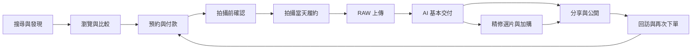

# WanderLens 使用者旅程與服務藍圖

本文件描述 WanderLens 從獲客、下單、拍攝、交付、精修、公開、回訪到再次下單的完整服務流程。服務藍圖同時覆蓋消費者、攝影師、平台營運與外包修圖公司，目標是讓產品規劃不只停留在功能清單，而能看見每個角色在每個階段的責任、資訊流與關鍵體驗。

## 1. 核心旅程總覽

整體旅程需符合兩個原則：

1. 首次下單前的摩擦盡量由網站承接，讓使用者不必下載 App 也能理解服務並完成轉換。
2. 拍攝後的所有高黏著互動都引導至 App，包括相簿、精修、分享、公開、歷程與再次預約。

## 2. 消費者旅程

| 階段 | 消費者目標 | 主要接觸點 | 關鍵體驗 | 平台需完成的事 |
| --- | --- | --- | --- | --- |
| 搜尋與發現 | 找到可信、價格透明、可快速預約的攝影服務 | Google 搜尋、公開作品頁、地點靈感頁、社群分享連結 | 一眼看懂服務、價格、作品風格與交付速度 | SEO 頁、公開內容池、服務類型頁、地點頁 |
| 瀏覽與比較 | 判斷是否值得下單 | 網站 RWD、攝影師作品頁、服務組合頁 | 作品說話，不被複雜表單打斷 | 類型導覽、攝影師列表、作品集、評分、透明價格 |
| 預約與付款 | 快速選定時間、地點與服務人員 | 階段一以網站為主、App 為輔，後續 App 補上完整預約 | 選到即確定，不等待攝影師回覆 | 三池媒合、檔期鎖定、價格計算、一般電商收款 |
| 拍攝前確認 | 確認細節與降低不安 | App、簡訊、Email、專案文件 | 攝影師於接案後 24 小時內主動聯繫，資訊集中可追溯 | 接案後 24 小時聯繫提醒、專案文件、客服可見紀錄 |
| 拍攝當天 | 順利完成拍攝，必要時加時 | App、攝影師現場互動 | 開始、加時、結束皆清楚記錄 | 時間戳記、加時申請、即時付款或加價紀錄 |
| 照片交付 | 快速看到可用照片 | App 相簿、通知 | 48 小時內上架，預覽清楚、下載容易 | RAW 驗收、AI 調色、相簿產生、交付通知 |
| 精修選片 | 挑出特別想精修的照片 | App 選片介面 | 直接在相簿中點選，不必傳檔或截圖 | 精修商品、選片、外包工單、付款紀錄 |
| 分享與公開 | 分享成果、展示自己、收藏回憶 | App、社群、公開頁 | 一鍵分享，公開選項清楚，不覺得被強迫 | 分享連結、公開授權、社群格式輸出、品牌露出 |
| 回訪與再次下單 | 回顧拍攝歷程、未來再拍 | App、推播、Email | 像相簿與旅程日記，而不是一次性訂單 | 拍攝歷程、日期地點、再次預約、推薦獎勵 |

## 3. 攝影師旅程

| 階段 | 攝影師目標 | 主要接觸點 | 平台要求 | 攝影師價值 |
| --- | --- | --- | --- | --- |
| 申請加入 | 成為可接案供給 | 攝影師端、營運審核 | 實名、作品集、器材與服務區、拍攝類型能力 | 平台帶客、降低接案成本 |
| 檔期維護 | 控制自己何時可接案 | 攝影師端行事曆 | 自行開放與封鎖時段 | 保留自由接案彈性 |
| 接案通知 | 確認新訂單資訊 | App 推播、Email | 收到已付款訂單與拍攝資訊 | 不必報價與反覆溝通 |
| 拍攝前聯繫 | 確認細節並建立信任 | App、電話、專案文件 | 接案後 24 小時內主動聯繫，逾時依分級懲罰處理 | 降低當天失誤 |
| 拍攝當天 | 專注拍攝 | 攝影師端履約按鈕 | 按開始、加時、結束 | 不需處理後製 |
| RAW 上傳 | 完成交付義務 | 攝影師端上傳工具 | 24 小時內上傳 RAW | 不用調色修圖，節省時間 |
| 收益查看 | 知道何時撥款 | 攝影師端或後台摘要 | 結案後產生應付金額 | 收益透明 |
| 作品曝光 | 累積個人品牌 | 公開作品集、攝影師頁 | 需取得消費者公開授權 | 平台替攝影師導流 |

攝影師端的核心產品承諾是「只拍攝、不後製、平台帶客」。因此 RAW 上傳工具必須被視為攝影師端最重要的基礎設施之一，否則免修圖的價值會被上傳痛苦抵消。

## 4. 平台營運旅程

| 階段 | 營運任務 | 後台能力 | 監控重點 |
| --- | --- | --- | --- |
| 供給審核 | 審核攝影師、造型師、攝影棚 | 身分審核、作品審核、服務區設定、價格設定 | 供給品質、區域供給密度 |
| 預約監控 | 追蹤付款後訂單 | 訂單列表、狀態機、異常提醒 | 未聯繫、未確認、即將拍攝 |
| 履約監控 | 確保拍攝按流程完成 | 起拍與結束時間戳記、加時紀錄 | 延遲、加時爭議、未按鈕紀錄 |
| 上傳驗收 | 確認 RAW 已上傳且完整 | 批次上傳狀態、檔案數、格式、容量 | 逾期上傳、缺檔、壞檔 |
| AI 交付 | 確保 48 小時內上架 | AI 狀態、失敗重試、交付倒數 | SLA 逾時、處理失敗 |
| 精修外包 | 管理加購修圖 | 工單、素材、規格、交期、成品驗收 | 延遲、退修、品質不一致 |
| 清算撥款 | 計算應收應付 | 訂單金額、平台抽成、攝影師應付、外包費用、銀行匯款紀錄 | 漏撥、錯撥、未對帳 |
| 客服爭議 | 處理取消、退款、品質問題 | 訂單事件紀錄、專案文件、照片版本、付款紀錄 | 爭議原因、補償、供給淘汰 |
| 內容營運 | 推動公開內容與 SEO | 公開授權、精選作品、地點頁、攝影師作品集 | 公開率、分享率、轉換率 |

## 5. 外包修圖公司旅程

初期不必建立完整外包平台，但服務藍圖中仍需定義清楚流程，避免外包修圖變成不可追蹤的人工黑箱。

| 階段 | 外包公司動作 | 平台提供 | 平台驗收 |
| --- | --- | --- | --- |
| 接收工單 | 確認可承接指定精修 | 工單編號、照片清單、RAW 下載、修圖規範、交期 | 是否接受、預估交付時間 |
| 下載素材 | 取得指定 RAW 與參考圖 | 安全下載連結、期限控管 | 下載狀態 |
| 精修作業 | 依規格處理照片 | 標準修圖規範、風格範本、客戶備註 | 中途不干預 |
| 上傳成品 | 回傳精修檔 | 上傳入口或雲端資料夾 | 檔名、張數、格式 |
| 驗收與退修 | 依規格確認品質 | 後台標記通過或退修 | 退修原因、完成時間 |
| 請款結算 | 定期請款 | 工單明細與費用紀錄 | 對帳與付款狀態 |

## 6. 服務藍圖總表

| 階段 | 消費者前台 | 攝影師端 | 營運後台 | 外包修圖 | 背後系統 |
| --- | --- | --- | --- | --- | --- |
| 搜尋 | 瀏覽 SEO 頁與公開作品 | 無 | 管理公開內容 | 無 | SEO、內容索引、場景標籤 |
| 下單 | 選類型、地點、時間、人員、付款 | 接收新案通知 | 監看新訂單 | 無 | 媒合、訂單、金流 |
| 拍攝前 | 查看專案文件 | 主動聯繫並記錄 | 監控 24 小時規則 | 無 | 通知、專案文件 |
| 拍攝 | 必要時確認加時 | 起拍、加時、結束 | 查詢履約紀錄 | 無 | 事件日誌、時間戳記 |
| 上傳 | 等待交付 | RAW 上傳 | 驗收 RAW | 無 | 物件儲存、檔案驗收 |
| 基本交付 | 查看 AI 成品 | 查看交付狀態 | 監控 SLA | 無 | AI 管線、相簿 |
| 精修 | 選片加購 | 無 | 派工與驗收 | 修圖交付 | 工單、RAW 權限 |
| 公開分享 | 分享、公開、下載 | 作品集曝光 | 管理授權與精選 | 無 | 授權、分享、SEO |
| 回訪 | 拍攝歷程、再次下單 | 收益與作品累積 | 看留存與轉換 | 無 | 行為事件、推播 |

## 7. 例外與異常流程

### 7.1 攝影師未於 24 小時內聯繫

系統需在接單後倒數 24 小時。若未記錄聯繫，營運後台收到提醒，可先通知攝影師補做聯繫；若逾時仍未處理，訂單進入重新媒合流程，並依平台規則對攝影師記錄違規。

### 7.2 RAW 上傳逾時或不完整

上傳需有批次狀態與完整性驗收。若 24 小時內未完成，先提醒攝影師；若仍未完成，營運可介入聯繫並標記訂單風險。此流程直接影響 48 小時交付承諾，必須在後台可視化。

### 7.3 AI 處理失敗

AI 管線失敗時需可重試、標記失敗原因，並通知營運。失敗不應直接暴露給消費者，消費者只需看到交付進度與必要的延遲通知。

### 7.4 消費者要求精修

消費者在 App 相簿中選片並付款後，系統建立精修工單。營運確認規格後派給外包修圖公司。外包公司取得指定 RAW，不取得整份訂單所有照片，降低資料暴露。

### 7.5 消費者公開後反悔

公開授權必須可撤回。撤回後，公開頁、攝影師作品集與 SEO 索引需進入下架流程。若照片已被社群平台二次分享，平台只能移除自有平台內容，這點需在公開設定中清楚說明。

### 7.6 加時被拒絕或加時付款失敗

攝影師於拍攝中發起加時，消費者在 App 內收到請求並可選擇同意或拒絕。同意需即時完成電商付款才生效，未付款前加時不成立。若消費者拒絕或付款失敗，攝影師仍依原訂時段執行，事件需完整記錄為日後計費與爭議依據。

### 7.7 攝影師臨時無法到場

天候、生病或交通因素導致無法依時履約時，攝影師需透過攝影師端通報，由系統觸發重新媒合或改期流程。改期需經消費者同意，重新媒合則優先尋找同區同類型的替代攝影師。臨時棄場依分級懲罰機制處理。

### 7.8 消費者取消與退款

取消依拍攝日距離分級處理：早期取消可全額退款、中期取消部分退款、近拍攝日取消視同違約。退款流程透過原電商金流逆向處理或人工銀行匯款，營運後台需完整記錄取消原因、退款金額與是否影響攝影師收益。

### 7.9 跨日大型拍攝的特殊狀況

婚禮、企業活動等跨整日或多日拍攝，需支援多時段、多供給、現場彈性調整。RAW 上傳期限應允許依拍攝量延後，AI 交付 SLA 也應依配置調整，不強套通用 48 小時。

## 8. 關鍵體驗指標

| 指標 | 對應目的 |
| --- | --- |
| 網站訪客到預約開始率 | 衡量獲客頁是否有效 |
| 預約開始到付款完成率 | 衡量流程摩擦 |
| 付款後 24 小時內聯繫率 | 衡量攝影師履約紀律 |
| 拍攝後 24 小時 RAW 完整上傳率 | 衡量交付管線健康度 |
| 48 小時內基本交付率 | 衡量平台承諾 |
| 精修選片率 | 衡量加購收入潛力 |
| 照片公開率 | 衡量內容平台化 |
| 社群分享率 | 衡量自然擴散 |
| 公開頁帶來的下單轉換 | 衡量內容池獲客能力 |
| 拍攝歷程回訪率 | 衡量 App 留存 |

