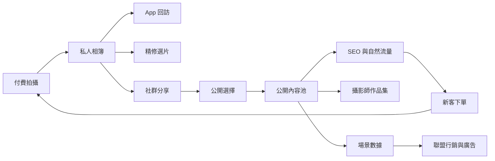

# WanderLens 內容與數據平台機制

本文件定義 WanderLens 如何從攝影服務延伸為內容平台與數據變現平台。核心前提是：使用者付費產生照片，平台透過 App 提供相簿、精修、分享與拍攝歷程，再透過鼓勵公開讓部分照片成為網站 SEO、攝影師作品集、地點靈感與未來聯盟行銷的內容資產。

## 1. 內容平台的核心邏輯

WanderLens 的內容不是平台自行大量生產，而是由消費者付費拍攝自然產生。平台的任務不是強迫使用者公開，而是讓公開成為一個合理、自然、有好處的選項。

內容平台要同時服務五個目的：

1. 幫消費者保存與回顧重要照片。
2. 幫消費者方便分享與展示自己。
3. 幫攝影師累積作品集與接案曝光。
4. 幫網站建立可被搜尋、可被分享的內容池。
5. 幫平台累積帶有地點、事件與行為脈絡的商業數據。

## 2. 相簿設計

### 2.1 私人相簿

私人相簿是 App 留存主場。預設每一筆拍攝完成後都產生一個拍攝相簿，內容包含：

- 拍攝日期、地點、城市、攝影師、拍攝類型。
- AI 基本調色成品。
- 可選擇精修的照片。
- RAW 是否仍在平台保留期內。
- 下載、分享、收藏、公開設定。
- 拍攝歷程與再次預約入口。

私人相簿的體驗應接近「專業拍攝回憶冊」，而不是檔案清單。它要讓使用者有回來看的理由，例如年份、家庭成長、旅行地圖、情侶紀念日、寶寶月份等歷程。

### 2.2 公開相簿

公開相簿不應只是把私人相簿整本公開，而應允許使用者挑選部分照片公開。公開單位可分成：

| 公開單位 | 適用情境 | 說明 |
| --- | --- | --- |
| 單張照片公開 | 多數一般使用者 | 使用者挑幾張最想展示的照片 |
| 精選組公開 | 旅拍、情侶、個人寫真 | 形成一組可分享故事 |
| 完整相簿公開 | 活動、空間、部分旅拍 | 適合本身就有宣傳目的的拍攝 |
| 攝影師作品集授權 | 攝影師需要展示作品 | 可公開於攝影師頁，但不一定進平台首頁 |
| 平台行銷授權 | 平台精選內容使用 | 可用於首頁、廣告素材或地點頁 |

公開設定需細分，避免「公開」變成單一高風險開關。

攝影師作品集授權具備雙向性質：消費者需同意特定照片可作為攝影師作品集使用，攝影師也需主動申請納入個人頁面。兩端授權必須同時存在，且任一方撤回時即下架。這是攝影師作品集合規與品質治理的基礎。

### 2.3 分享相簿

分享不等於公開。使用者可產生私密分享連結，分享給親友或社群。分享連結若被大量瀏覽，仍可形成行為數據，但不應自動變成公開內容。

分享層級建議：

| 分享層級 | 可見範圍 | 是否進 SEO |
| --- | --- | --- |
| 私密 | 只有本人 | 否 |
| 連結分享 | 擁有連結者 | 否 |
| 社群分享 | 使用者主動分享到外部平台 | 否，除非另行公開 |
| 平台公開 | 可在 WanderLens 網站被看見 | 是 |
| 精選公開 | 可被平台主動推薦與收錄 | 是 |

## 3. 公開照片誘因設計

使用者願意曝光與展示自己，特別是家庭、寶寶、情侶、旅拍、個人寫真等場景。產品應樂觀看待公開意願，但仍需讓公開是使用者主動選擇。

### 3.1 自然誘因

| 誘因 | 產品做法 | 對平台的價值 |
| --- | --- | --- |
| 社群展示 | 一鍵產生適合 Instagram、Threads、Facebook、LINE 的格式 | 自然擴散 |
| 成就感 | 拍攝歷程、家庭成長、旅遊地圖、紀念日相簿 | 提高回訪 |
| 被看見 | 進入地點靈感、風格範例、攝影師作品集 | 增加公開率 |
| 實用性 | 親友可方便瀏覽與下載 | 提高分享率 |
| 回饋 | 下次拍攝折抵、精修折扣、推薦獎勵 | 把公開變成可控獲客成本 |

### 3.2 公開時機

公開選項不應只在交付當下出現一次。適合的觸發時機包括：

1. 使用者第一次打開相簿，看到照片品質後。
2. 使用者下載或分享照片時。
3. 使用者選擇精修完成後。
4. 拍攝週年、寶寶月份、旅行回顧等回訪節點。
5. 攝影師希望將照片加入作品集時，由平台發出授權請求。

### 3.3 公開呈現方式

公開內容應以「人、場景、地點、風格」多種角度呈現，而不是只做單一瀑布流。

| 呈現方式 | 說明 | 對應流量 |
| --- | --- | --- |
| 地點靈感頁 | 例如「台北大稻埕情侶寫真」、「陽明山家庭照」 | Google 搜尋、旅遊搜尋 |
| 拍攝類型頁 | 例如「寶寶寫真作品」、「個人寫真範例」 | 服務需求搜尋 |
| 攝影師作品頁 | 攝影師公開作品、評價、可預約時段 | 下單轉換 |
| 使用者故事頁 | 一組照片加簡短故事 | 社群分享 |
| 精選首頁 | 平台人工或演算法精選 | 品牌形象 |

## 4. SEO 內容池

網站不是靜態官網，而是公開內容池的搜尋入口。每一張公開照片、每一個地點、每一種拍攝類型、每一位攝影師，都可能產生 SEO 頁。

### 4.1 SEO 頁型

| 頁型 | 範例 | 主要目的 |
| --- | --- | --- |
| 拍攝類型頁 | 台北個人寫真、親子攝影、寶寶寫真 | 承接明確需求 |
| 地點頁 | 大稻埕拍照、陽明山旅拍、淡水情侶照 | 承接地點靈感搜尋 |
| 攝影師頁 | 某攝影師作品集與可預約時間 | 轉換下單 |
| 公開相簿頁 | 某家庭寫真故事、某旅拍作品集 | 社群分享與長尾搜尋 |
| 主題集合頁 | 台北雨天拍攝推薦、畢業季拍攝靈感 | 內容行銷 |

### 4.2 SEO 頁資料來源

SEO 內容頁不應全部靠人工撰寫，而應由結構化資料生成：

- 拍攝類型來自訂單。
- 地點來自預約地點與拍攝歷程。
- 作品來自使用者公開授權。
- 攝影師資訊來自供給資料與公開作品。
- 評價來自訂單完成後回饋。
- 熱門程度來自行為事件與轉換數據。

## 5. 場景標籤系統

場景標籤是內容平台與變現平台之間的橋。它讓照片不只是影像，而是帶有商業脈絡的資料。

### 5.1 標籤來源

| 來源 | 標籤示例 | 自動化程度 |
| --- | --- | --- |
| 訂單資料 | 拍攝類型、地點、日期、服務配置 | 高 |
| 地圖資料 | 城市、行政區、景點、附近商圈 | 高 |
| 使用者輸入 | 標題、故事、用途、公開說明 | 中 |
| AI 影像辨識 | 人數、室內外、風格、物件、場景 | 中 |
| 營運人工精選 | 主題、活動、季節、推薦等級 | 低但品質高 |
| 行為資料 | 分享多、收藏多、轉換高 | 高 |

### 5.2 標籤分類

| 類別 | 範例 | 用途 |
| --- | --- | --- |
| 拍攝類型 | 個人寫真、寶寶、家庭、婚紗、旅拍、活動 | 服務分類與廣告分眾 |
| 人物關係 | 親子、情侶、朋友、同事、夫妻 | 內容推薦 |
| 地點 | 台北、大稻埕、海邊、咖啡廳、攝影棚 | SEO 與聯盟行銷 |
| 情境 | 生日、畢業、求婚、週年、懷孕、旅行 | 商業合作 |
| 風格 | 自然、日系、韓系、復古、清新、正式 | 攝影師匹配與推薦 |
| 商業意圖 | 婚禮、母嬰、旅遊、職涯、居家 | 聯盟行銷 |

## 6. 行為數據層

平台需記錄的不只是訂單交易，也包含內容如何被使用。這些行為未來會決定哪些內容值得公開、哪些場景有變現價值、哪些國家或城市有跨境擴張訊號。

| 行為事件 | 說明 | 用途 |
| --- | --- | --- |
| AlbumViewed | 使用者或訪客瀏覽相簿 | 留存與內容熱度 |
| PhotoDownloaded | 下載照片 | 交付完成度 |
| PhotoShared | 分享到外部平台 | 自然擴散 |
| PhotoMadePublic | 設為公開 | 內容供給 |
| PublicPageViewed | 公開頁被瀏覽 | SEO 效果 |
| BookingStartedFromContent | 從公開內容開始預約 | 內容轉換 |
| RetouchSelected | 選擇精修照片 | 加購潛力 |
| PhotographerViewed | 瀏覽攝影師頁 | 供給轉換 |
| LocationViewed | 瀏覽地點靈感頁 | 地點需求 |
| ReferralClicked | 推薦連結點擊 | 口碑擴散 |

## 7. 聯盟行銷與廣告對接

變現不應一開始就做成大型廣告系統，而應從「場景明確、轉換自然」的合作開始。

| 場景 | 合作方向 | 對接位置 |
| --- | --- | --- |
| 婚禮、婚紗、求婚 | 婚戒、喜餅、婚宴場地、蜜月旅遊 | 拍攝後相簿、公開故事頁、精修交付頁 |
| 寶寶、孕婦、家庭 | 母嬰品牌、月子中心、親子旅遊、早教 | 拍攝歷程、寶寶月份相簿、家庭公開頁 |
| 個人形象照 | 履歷服務、職涯平台、服飾、形象顧問 | 交付頁、再次拍攝推薦 |
| 旅拍 | 住宿、餐廳、在地體驗、交通票券 | 地點靈感頁、公開旅拍頁、跨境推薦 |
| 空間攝影 | 室內設計、家具、開店服務 | 空間作品頁、商家公開頁 |
| 活動紀錄 | 場地、餐飲、票務、活動工具 | 活動相簿分享頁 |

### 7.1 對接原則

1. 聯盟行銷必須跟拍攝場景高度相關，不能變成干擾相簿體驗的泛廣告。
2. 私人相簿中的商業推薦要克制，以服務延伸為主。
3. 公開內容頁可以承擔較多導流功能，但仍需維持內容品質。
4. 合作夥伴應依場景標籤投放或推薦，而非只依人口屬性。

## 8. 公開與授權資料模型

公開照片要能形成內容平台，前提是授權狀態必須清楚可控。每張照片或每組相簿至少需要以下授權維度：

| 授權維度 | 說明 |
| --- | --- |
| 私人可見 | 只有使用者與被授權者可見 |
| 連結分享 | 擁有連結者可看 |
| 平台公開 | 可出現在 WanderLens 網站 |
| 攝影師作品集 | 可出現在攝影師個人頁 |
| 平台行銷 | 可被平台放在首頁、廣告素材、社群貼文 |
| 商業合作 | 可與合作品牌或聯盟行銷內容一起出現 |
| 可撤回 | 使用者可撤回公開授權 |

初期可以只開放前三到四種授權，但資料模型需要預留後續變現需要。

## 9. 內容治理

公開內容池若要成為平台資產，必須有治理機制。

| 問題 | 機制 |
| --- | --- |
| 品質不一致 | AI 初篩、人工精選、攝影師評分 |
| 隱私疑慮 | 預設私密、公開確認、可撤回 |
| 不適合公開內容 | 檢舉、審核、下架 |
| 攝影師與消費者權益 | 雙方授權狀態清楚記錄 |
| SEO 低品質頁過多 | 只有達到公開數量與品質門檻才生成索引頁 |
| 內容老化 | 地點頁與作品集定期更新 |

### 9.1 未成年人公開特別處理

寶寶、孩童、家庭、畢業等場景常涉及未成年人，需採取比一般照片更嚴格的治理：

| 治理項目 | 設計 |
| --- | --- |
| 預設更高隱私 | 含未成年人的照片預設不可平台公開，使用者需主動確認 |
| 額外確認 | 公開前明確告知後果與可能被搜尋到，並請使用者再次確認 |
| 監護人同意 | 帳號持有人即視為監護人代理，但若被檢舉非監護人發布，需有快速下架流程 |
| 不進入廣告素材 | 預設不納入平台行銷與商業合作授權，即使使用者同意公開 |
| 不做面部辨識用途 | 平台不對未成年人臉部進行可識別性辨識或對外提供 |
| 易於下架 | 一鍵下架且需立即生效，不受 SEO 索引快取延遲影響 |

### 9.2 攝影師與消費者授權爭議

當攝影師希望公開作品但消費者不同意，或消費者希望公開但攝影師希望保留商用權，平台需提供清楚的處理規則：

- 預設兩端授權都需明示同意才能公開。
- 任一方撤回授權即立即下架，不需另一方同意。
- 平台不替任一方代行授權，授權狀態需可追溯。
- 若涉及商業使用收益分潤，需在授權同意時明確標示比例與條件。

## 10. 內容平台指標

| 指標 | 解釋 |
| --- | --- |
| 公開率 | 已交付相簿中至少一張公開的比例 |
| 分享率 | 相簿被分享到外部社群或親友的比例 |
| 公開內容轉換率 | 公開頁帶來預約開始或付款的比例 |
| 攝影師作品授權率 | 消費者同意進入攝影師作品集的比例 |
| 地點頁自然流量 | SEO 地點頁帶來的訪客 |
| 拍攝類型頁轉換 | 不同拍攝類型內容頁的下單能力 |
| 精修加購率 | 從相簿中選片精修的比例 |
| 回訪率 | 使用者回到 App 看舊相簿的比例 |
| 聯盟點擊率 | 場景推薦的點擊與轉換 |
| 跨境訊號 | 來自不同國家訪客、分享、推薦與預約意圖 |

## 11. 產品結論

內容平台的關鍵不是「使用者是否願意公開全部照片」，而是平台能否把使用者願意公開的少量高品質照片，轉化為可搜尋、可分享、可轉換、可變現的內容節點。家庭、寶寶、情侶、個人寫真與旅拍都有公開潛力，只是公開動機不同。產品應順著使用者想展示、想紀念、想分享的心理設計，而不是用硬性規則要求公開。

