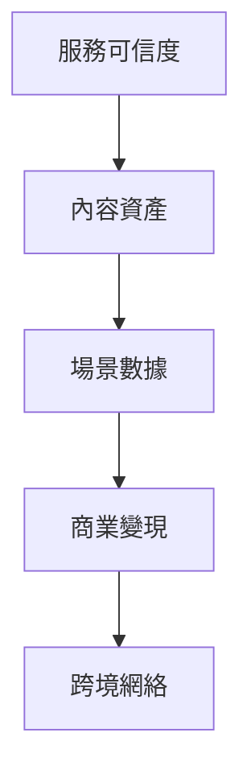

# WanderLens 階段化產品路線

本文件在完整產品藍圖下規劃 WanderLens 的階段化產品路線。這不是開發 MVP 清單，而是定義平台能力如何從「服務可成立」逐步演進到「內容平台」、「數據變現平台」與「跨境網絡」。

## 1. 路線設計原則

1. 先建立服務可信度，再放大內容與數據價值。
2. 先讓網站承擔獲客，再讓 App 承擔留存。
3. 先把 RAW、相簿、公開授權與場景標籤的資料結構設對，再逐步啟動變現。
4. 金流初期維持一般電商收款與後台清算，先追求營運可控。
5. 每一階段都要能為下一階段沉澱資料或內容，不做孤立功能。

## 2. 五階段總覽

| 階段 | 核心目標 | 平台成熟重點 |
| --- | --- | --- |
| 階段一：服務驗證 | 證明需求側願意下單，服務流程跑得動 | 網站獲客、單區預約、RAW 上傳、AI 基本交付、後台清算 |
| 階段二：服務完整化 | 建立多供給池與更完整服務類型 | 攝影棚、造型師、雙機、精修外包、評價與供給治理 |
| 階段三：內容平台化 | 讓相簿、公開、分享、SEO 內容池開始產生飛輪 | App 留存、公開照片、地點靈感、攝影師作品集 |
| 階段四：數據變現 | 把場景與行為數據轉為商業合作收入 | 聯盟行銷、品牌合作、場景推薦、數據後台 |
| 階段五：跨境網絡 | 用入境旅拍播種海外市場，再接出境客流 | 多語、多幣、海外供給、跨境推薦、國家市場訊號 |

## 3. 階段一：服務驗證

### 3.1 階段目標

此階段不是只做最小功能，而是驗證整個服務承諾是否成立：使用者是否會下單、攝影師是否能按流程履約、RAW 是否能被順利上傳、AI 基本交付是否能在期限內完成、平台是否能完成收款與後台清算。

### 3.2 客戶端開發優先順序

階段一不應同時開發網站、消費者 App、攝影師 App 三端，而應依角色決定先後：

| 優先順序 | 端點 | 此階段角色 | 形態建議 |
| --- | --- | --- | --- |
| 第一優先 | 網站 RWD | 獲客、首次下單、付款 | 響應式網站，含預約流程與付款 |
| 第二優先 | 攝影師端 | 接案、履約節點、RAW 上傳 | 可先以 App 或 PWA 實作，重點是上傳穩定 |
| 第三優先 | 消費者 App 雛形 | 拍攝後相簿、分享、再次預約 | 可先以網頁版相簿過渡，App 在階段二補齊 |
| 第四優先 | 營運後台 | 訂單、上傳、交付、清算監控 | Web 後台，內部使用即可 |

消費者 App 不必在階段一同步推出。網站搭配網頁版相簿就足以承接首次下單與基本交付體驗，App 留存價值待階段三再放大。

### 3.3 產品範圍

| 模組 | 應具備能力 |
| --- | --- |
| 網站與 RWD | 服務介紹、拍攝類型頁、作品展示、預約入口、付款流程、網頁版相簿 |
| 預約媒合 | 單區、外拍、單攝影師、明確時間地點、選到即確定 |
| 攝影師端 | 檔期維護、接案通知、接案後 24 小時內聯繫、起拍結束、RAW 上傳 |
| RAW 管線 | 分段上傳、斷點續傳、JPEG 快路徑、批次驗收、雲端保存 |
| AI 基本交付 | 基本調光調色、預覽圖、相簿交付、48 小時監控 |
| 營運後台 | 訂單狀態、攝影師管理、上傳狀態、交付狀態、清算紀錄、爭議處理 |
| 金流 | 一般電商付款、平台收款、後台應付攝影師金額、加時即時付款、退款流程 |
| 相簿 | 基本交付相簿、下載、分享連結、公開設定雛形 |

### 3.4 需沉澱的資料

- 拍攝類型、地點、日期與價格。
- 預約開始、付款完成、取消與客服原因。
- 攝影師聯繫時間、拍攝開始與結束時間。
- RAW 上傳時間、檔案數、容量、失敗原因。
- AI 交付時間與是否逾時。
- 相簿瀏覽、下載、分享、公開。

### 3.5 成功判準

| 指標 | 意義 |
| --- | --- |
| 需求側真實成交 | 證明不是只有供給端有意願 |
| 預約完成率 | 流程是否足夠簡單 |
| 攝影師 24 小時聯繫率 | 履約紀律是否可控 |
| RAW 24 小時完整上傳率 | 媒體管線是否可行 |
| 48 小時交付率 | 核心服務承諾是否成立 |
| 客訴率與退款率 | 低價快速服務是否能被接受 |
| 分享率與初步公開率 | 內容平台潛力 |

## 4. 階段二：服務完整化

### 4.1 階段目標

從單一服務配置擴展為完整的服務組合，納入攝影棚、造型師、雙攝影師、婚禮、婚紗、企業形象與精修加購。此階段的重點是讓多供給池媒合與服務品質治理成熟。

### 4.2 產品範圍

| 模組 | 應具備能力 |
| --- | --- |
| 多供給池媒合 | 攝影師、攝影棚、造型師檔期交集 |
| 造型師時序 | 自動計算拍攝前妝髮緩衝 |
| 雙機服務 | 雙攝影師價格、檔期與角色配置 |
| 棚拍服務 | 攝影棚頁、棚型、可用時段與價格 |
| 精修加購 | App 選片、付款、外包工單、成品驗收 |
| 評價與信任 | 消費者評價、攝影師評分、違規紀錄、淘汰機制 |
| 供給治理 | 攝影師分級、作品集管理、服務範圍、價格帶 |
| 後台清算 | 攝影師、攝影棚、造型師、外包修圖費用分項紀錄 |

### 4.3 需沉澱的資料

- 各服務類型的下單率、客訴率、毛利與交付難度。
- 造型師與攝影棚的檔期利用率。
- 精修選片率、客單價提升、外包交期與退修率。
- 不同配置的服務品質與評價差異。

### 4.4 成功判準

| 指標 | 意義 |
| --- | --- |
| 多供給池訂單成功率 | 複雜媒合是否成立 |
| 精修加購率 | 第二層收入潛力 |
| 外包準時交付率 | 外包流程是否可控 |
| 供給留存率 | 攝影師與造型師是否願意持續接案 |
| 評價分布 | 品質治理是否有效 |

## 5. 階段三：內容平台化

### 5.1 階段目標

讓 App 從交付工具變成回訪引擎，讓公開照片從附屬功能變成網站獲客內容池。此階段的核心不是增加更多拍攝類型，而是讓內容資產開始產生自然流量與再次下單。

### 5.2 產品範圍

| 模組 | 應具備能力 |
| --- | --- |
| App 相簿 | 拍攝歷程、年份、地點、人物關係、收藏、再次下單 |
| 公開設定 | 單張公開、精選組公開、攝影師作品集授權、平台公開 |
| 分享工具 | 社群格式輸出、私密連結、品牌印記、推薦連結 |
| SEO 內容池 | 地點靈感頁、拍攝類型頁、公開故事頁、攝影師作品頁 |
| 內容治理 | 精選、審核、下架、授權撤回 |
| 場景標籤 | 地點、類型、風格、情境、人物關係 |
| 回訪召回 | 推播、拍攝週年、寶寶月份、旅遊回顧 |

### 5.3 需沉澱的資料

- 哪些拍攝類型最願意公開。
- 哪些地點頁帶來最多自然流量與轉換。
- 哪些照片或相簿最常被分享。
- 哪些攝影師作品頁轉換率高。
- App 回訪與再次下單的關係。

### 5.4 成功判準

| 指標 | 意義 |
| --- | --- |
| 相簿回訪率 | App 是否形成留存 |
| 照片公開率 | 內容供給是否足夠 |
| 公開頁自然流量 | SEO 內容池是否有效 |
| 內容頁到下單轉換率 | 內容是否能變成獲客資產 |
| 再次下單率 | 情感型留存是否成立 |

## 6. 階段四：數據變現

### 6.1 階段目標

當平台已累積足夠公開內容、場景標籤與行為數據後，啟動廣告與聯盟行銷變現。此階段的重點不是賣廣告版位，而是根據真實拍攝場景提供高相關商業推薦。

### 6.2 產品範圍

| 模組 | 應具備能力 |
| --- | --- |
| 數據後台 | 拍攝場景、地點、公開內容、分享、加購與轉換分析 |
| 聯盟夥伴管理 | 品牌、佣金、連結、素材、合作場景 |
| 場景推薦 | 婚禮、母嬰、旅拍、職涯、空間等推薦模組 |
| 轉換追蹤 | 聯盟點擊、成交回傳、內容來源歸因 |
| 商業內容治理 | 避免廣告干擾私人相簿體驗 |
| 成效報表 | 合作夥伴可看到曝光、點擊與轉換 |

### 6.3 優先變現場景

| 優先度 | 場景 | 原因 |
| --- | --- | --- |
| 高 | 婚禮、婚紗、求婚 | 客單高、周邊消費強 |
| 高 | 寶寶、孕婦、家庭 | 父母分享意願高，母嬰合作明確 |
| 高 | 旅拍 | 可接地點、住宿、餐飲、跨境策略 |
| 中 | 個人形象照 | 職涯、服飾、形象顧問可對接 |
| 中 | 空間攝影 | 室內設計與家具合作潛力 |
| 中 | 活動紀錄 | 場地、餐飲、票務合作 |

### 6.4 成功判準

| 指標 | 意義 |
| --- | --- |
| 聯盟點擊率 | 推薦是否相關 |
| 聯盟成交率 | 場景數據是否具商業價值 |
| 每筆訂單衍生收入 | 服務收入之外的變現能力 |
| 公開內容商業貢獻 | 內容平台是否反哺收入 |
| 廣告干擾客訴率 | 變現是否傷害體驗 |

## 7. 階段五：跨境網絡

### 7.1 階段目標

用台灣入境旅拍產生海外市場種子，再用台灣出境旅客接住已開通市場，形成雙向跨境飛輪。此階段不是單純翻譯網站，而是建立可跨國運作的供給、需求、內容與推薦網絡。

### 7.2 產品範圍

| 模組 | 應具備能力 |
| --- | --- |
| 多語網站 | 英文、日文、韓文、繁中，依客源市場擴展 |
| 多幣別價格 | 台幣、美元、日圓、韓元等展示與收款策略 |
| 入境旅拍頁 | 台灣地點靈感、外國旅客預約、簡化溝通 |
| 跨境分享 | 依國家支援主流社群與分享格式 |
| 推薦獎勵 | 跨國推薦碼、回國後轉換追蹤 |
| 海外供給招募 | 依需求訊號開城市與攝影師供給池 |
| 國家市場訊號 | 來源國、分享、推薦、預約意圖、轉換率 |

### 7.3 需沉澱的資料

- 入境旅客來源國與城市。
- 外國旅客拍攝後分享的平台與轉換。
- 哪些國家產生最多推薦點擊與預約意圖。
- 台灣出境旅客對已開通市場的使用率。
- 不同國家攝影師供給招募成本與服務品質。

### 7.4 成功判準

| 指標 | 意義 |
| --- | --- |
| 入境旅拍下單數 | 台灣作為點火市場是否成立 |
| 外國旅客分享率 | 種子是否可繁殖 |
| 來源國推薦轉換 | 哪些市場值得開通 |
| 海外城市供需平衡 | 跨境供給是否健康 |
| 出境旅拍使用率 | 雙向飛輪是否啟動 |

## 8. 跨階段能力依賴

| 能力 | 必須何時設計 | 何時完整發揮 |
| --- | --- | --- |
| 網站 SEO 架構 | 階段一 | 階段三 |
| RAW 雲端保存 | 階段一 | 階段二後持續擴大 |
| 公開授權模型 | 階段一 | 階段三 |
| 場景標籤 | 階段一 | 階段四 |
| 行為事件 | 階段一 | 階段三、四 |
| 清算帳本 | 階段一 | 階段二後更重要 |
| 外包精修工單 | 階段二 | 階段二、四 |
| 聯盟行銷資料 | 階段三預備 | 階段四 |
| 多語多幣基礎 | 階段三預備 | 階段五 |

## 9. 不同階段的產品重心

| 時期 | 最重要問題 | 不應過早投入 |
| --- | --- | --- |
| 階段一 | 消費者是否願意下單，平台是否能準時交付 | 複雜廣告系統、跨境供給 |
| 階段二 | 多供給池與精修外包是否可控 | 大規模國際化 |
| 階段三 | 相簿與公開內容是否能帶來回訪與自然流量 | 過度商業化推薦 |
| 階段四 | 場景數據是否能產生額外收入 | 與場景無關的泛廣告 |
| 階段五 | 網絡節點是否能互相餵養 | 無數據依據的海外撒點 |

## 10. 結構性風險的階段對應

原企劃書第 7 章已點出三項結構性風險，這些風險不會在單一階段一次解決，而是隨平台規模擴大逐步處理。產品路線需明確標示每項風險的對應時點，避免到後期才補救。

| 結構性風險 | 主要風險點 | 階段一 | 階段二 | 階段三 | 階段四 | 階段五 |
| --- | --- | --- | --- | --- | --- | --- |
| 勞動關係與從屬性 | 攝影師、造型師被認定為僱傭 | 採承攬契約、攝影師自主決定接案 | 加入評價與懲罰機制時保留自主性設計 | 規模擴大需法律盤點 | 與工會或職業團體合作補強 | 海外市場依當地法規重新檢視 |
| 個資與著作權 | 影像留存、公開、商用授權 | 預設私密、公開授權雛形、會員條款 | 攝影師授權、修圖外包資料隔離 | 多層授權上線、未成年人特別處理 | 商業合作授權與分潤條款 | 跨境資料落地與當地隱私法規 |
| 早期採用者偏差 | 早期攝影師動機與主流市場不同 | 觀察早期供給的服務品質與留存 | 評價與分級機制落地 | 公開內容與作品集篩選機制 | 服務品質與品牌一致性治理 | 海外攝影師招募標準化 |

此外，技術與營運層面也應在相對應階段處理以下風險：

| 風險類別 | 階段對應 | 處理方式 |
| --- | --- | --- |
| RAW 上傳穩定性 | 階段一 | 分段上傳、斷點續傳、JPEG 快路徑、上傳監控 |
| 48 小時 SLA 失效 | 階段一 | AI 失敗重試、營運告警、必要補償流程 |
| 多供給池媒合錯誤 | 階段二 | 造型師緩衝、檔期衝突、雙機角色衝突 |
| 精修外包品質不穩 | 階段二 | 規範文件、驗收流程、退修紀錄 |
| 公開內容侵權或申訴 | 階段三 | 檢舉、人工審核、快速下架 |
| 廣告干擾體驗 | 階段四 | 場景相關性門檻、私人相簿廣告克制 |
| 跨境法規與支付差異 | 階段五 | 多幣多語、當地金流、當地隱私與消費者保護 |

## 11. 最終產品形態

成熟後的 WanderLens 應同時具備五種身份：

1. 對消費者，是可快速預約、低門檻、交付穩定的攝影服務。
2. 對攝影師，是免後製、可彈性接案、有作品曝光的供給平台。
3. 對使用者關係與回憶，是可回訪、可分享、可累積歷程的照片平台。
4. 對品牌與合作夥伴，是以真實拍攝場景為基礎的行銷入口。
5. 對跨境旅客，是到不同城市都能找到當地攝影師的旅拍網絡。

階段化路線的重點不是把這五種身份一次做完，而是確保每一階段都在為下一層價值鋪路：服務產生內容，內容產生數據，數據產生變現，變現反哺獲客與跨境擴張。

