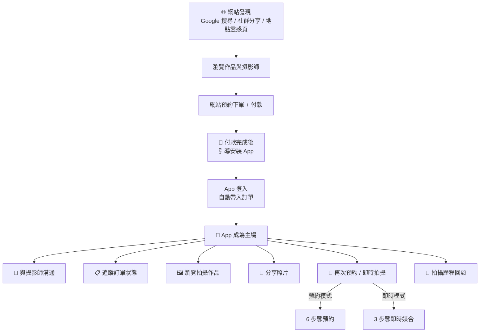
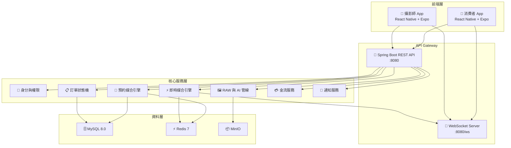
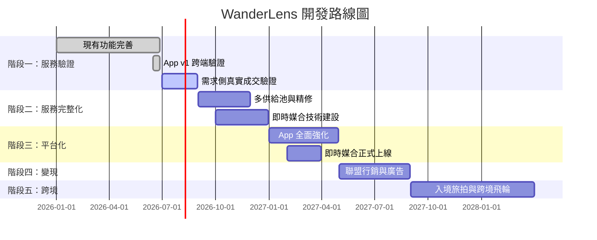

# WanderLens App 開發計畫與產品規格書

WanderLens App Development Plan & Product Specification

**版本：v4.2**
**日期：2026-06-27**
**機密文件 Confidential**

---

# 目錄

0. [開發現況摘要（2026-06-27）](#0-開發現況摘要2026-06-27)
   - [0.7 Web / Provider / Admin 強化](#07-web--provider--admin-強化2026-06-27)
1. [系統總覽與架構](#1-系統總覽與架構)
2. [消費者 App 完整規格](#2-消費者-app-完整規格)
3. [攝影師 App 完整規格](#3-攝影師-app-完整規格)
4. [API 後端架構與整合分析](#4-api-後端架構與整合分析)
5. [即時媒合技術規格](#5-即時媒合技術規格)
6. [開發階段與 Task Plan](#6-開發階段與-task-plan)
7. [技術棧與基礎設施](#7-技術棧與基礎設施)
8. [風險與緩解](#8-風險與緩解)

---

# 0. 開發現況摘要（2026-06-27）

> 本章反映截至 **2026-06-27** 的實際程式碼、Docker 環境與跨端驗證結果。下方產品規格（§2–§5）仍為目標定義；本章說明**目前已做到哪裡**、**還差什麼**。

## 0.1 整體評估

| 維度 | 分數 | 說明 |
| --- | :---: | --- |
| 功能完整與高端感 | **9** | 兩款 App 核心流程（登入、預約、訂單、訊息、收益、即時媒合 UI）均已實作並可本地操作 |
| 與 Web / 後端整合 | **9** | 消費者、攝影師、Web 共用同一後端；HTTP 實測同一訂單／對話雙向可見 |
| 視覺與 UX | **9** | Design Token、亮／深色模式、i18n、StateView 錯誤／空狀態已全面套用 |

## 0.2 兩款 App 現況

| 專案 | 技術 | Screens | Tab | 狀態 |
| --- | --- | :---: | :---: | --- |
| `wanderlens-app` | RN 0.74 + Expo 51 | **16** | **5**（首頁／相簿／預約／訊息／個人） | ✅ 可本地 Web 預覽 |
| `wanderlens-provider-app` | RN 0.74 + Expo 51 | **11** | **6**（首頁／行事曆／訂單／訊息／收益／我的） | ✅ 可本地 Web 預覽 |

**消費者 App 已實作 Screen（16）**：Login、Home、Booking（6 步驟 wizard）、InstantShoot、OrderList、OrderDetail、PaymentWebView、AlbumList、AlbumDetail、ConversationList、ConversationRoom、ShootingHistory、Notification、Profile、Settings、Preferences。

**攝影師 App 已實作 Screen（11）**：Login、Home（含接單模式＋WebSocket）、Schedule、OrderList、OrderDetail、ConversationList、ConversationRoom、Earnings、Rating、Notification、Profile。

**UI／UX 基礎建設（兩端共用模式）**：
- Design Token（`ThemeProvider`、亮／深色、`useColors`）
- i18n（繁中＋英文）
- 共用元件（Button、Text、StateView、ScreenHeader 等）
- Axios JWT interceptor、401 自動登出
- Expo Web 相容（`react-native-maps` Metro stub；`SafeAreaProvider` 已補）

## 0.3 後端與跨端整合

| 項目 | 狀態 | 備註 |
| --- | --- | --- |
| JWT 登入 | ✅ | `POST /auth/login`；攝影師回應含 `providerId` |
| 註冊／個人資料 | ✅ | `POST /auth/register`、`PUT /auth/me` |
| 訂單／溝通／相簿 API | ✅ | 兩端 App 已對接 |
| 即時媒合 API | ✅ 程式完成 | `MatchController` + WebSocket；待封測實戰驗證 |
| 推播 device token | ✅ 程式完成 | `POST /notify/device-token` + Expo Push |
| CORS（Expo Web） | ✅ 已修 | 允許 `localhost:19010`、`19011` |
| 示範種子資料 | ✅ | 4 公開相簿、3 訂單、1 訂單對話（`seed-demo-content.sql`） |
| 相簿實際照片 | ⚠️ 無 | `media_asset` 為 0；列表顯示占位圖示，屬正常現況 |

**跨端驗證（2026-06-27）**：同一 `DEMO-0001` 訂單與 `conversation #1`（order_id=7），消費者與攝影師 App 均可讀取；Web `/albums/public` 與消費者 `/albums` 同源 4 本相簿。

## 0.4 本地開發環境

### Docker 服務（`wanderlens-infra`）

```bash
cd wanderlens-infra
docker compose up -d                    # 核心：mysql / redis / minio / api / web
docker compose --profile full up -d     # 全棧：+ media / provider-web / admin / nginx
```

| 服務 | 埠 | 說明 |
| --- | --- | --- |
| API | 8080 | `http://localhost:8080/api` |
| Web（Nuxt） | 3001 | 消費者獲客網站 |
| 攝影師 Web | 3002 | Vue 工作站 |
| 營運後台 | 3003 | Vue Admin |
| Media | 3004 | FastAPI 影像管線（`rawpy==0.27.0`） |
| Nginx | 80 | 全棧反向代理 |

### Expo Web（App 預覽）

```bash
# 終端 1 — 消費者 App
cd wanderlens-app
npx expo start --web --port 19010

# 終端 2 — 攝影師 App
cd wanderlens-provider-app
npx expo start --web --port 19011
```

### 示範登入帳號（密碼皆為 `123456`）

| 用途 | 帳號 | 密碼 | 預覽網址 |
| --- | --- | --- | --- |
| 消費者 App | `consumer1` | `123456` | http://localhost:19010 |
| 攝影師 App | `photographer1` | `123456` | http://localhost:19011 |
| 後台 Admin | `admin` | `123456` | http://localhost:3003 |

> **常見問題**：若登入顯示「網路錯誤」，請確認 `wanderlens-api` 容器在跑，且 CORS 已含 App 所用 port（見 §0.3）。

## 0.5 已知限制（誠實標註）

1. **相簿無實拍縮圖**：種子只建 `album` metadata，未上傳 MinIO／未寫 `media_asset`；詳情頁亦無照片格，**非 Bug**。
2. **綠界金流**：後端整合完成，App 以 `PaymentWebViewScreen` 開啟；正式商戶金鑰與 staging 端對端付款待配置。
3. **EAS 正式打包**：`assets/icon.png`、`splash.png` 與 EAS `projectId` 仍待填入（見 §7.3.2）。
4. **即時媒合**：程式與 UI 就緒，需封測期間驗證「在線攝影師＋WebSocket 推播」實戰穩定度。
5. **Web 深色模式**：消費者網站（Nuxt）已支援 class 切換深色模式（Header 🌙/☀️）；首頁、預約、攝影師列表已用 Design Token（`--wl-bg-card`）對齊深色；部分行銷區塊 scoped CSS 仍可再深化。

## 0.6 階段一 Task 完成對照（精簡）

| ID | 任務 | 狀態 |
| --- | --- | --- |
| S1-001 | 消費者首頁（雙入口＋精選＋地點靈感） | ✅ |
| S1-002 | 預約 6 步驟 wizard | ✅ |
| S1-003 | 金流 WebView | ✅ |
| S1-004 | 相簿公開設定 UI | ✅ |
| S1-005 | 拍攝歷程 | ✅ |
| S1-006 | 分享工具 | ✅ |
| S1-007～015 | 攝影師 App 全模組 | ✅ |
| S1-016～017 | FCM／Expo Push 後端＋App token | ✅ 程式完成 |
| S1-018 | 端到端整合測試 | 🟡 部分（`AuthIntegrationTest`、Playwright 截圖、跨端 HTTP、`album-flow` E2E；staging 金流／媒合待跑） |

## 0.7 Web / Provider / Admin 強化（2026-06-27）

> Wave 1–4 已完成：品牌對齊、axios 統一、相簿 parity、toast、i18n、E2E、深色 polish、後台 build 修復。

| 專案 | 估分 | 重點 |
| --- | :---: | --- |
| `wanderlens-web` | **~8.5** | `#F37A69` token、dark mode、toast 全站、相簿 PhotoViewer／收藏／consent、WlStateView、`album-flow` E2E |
| `wanderlens-provider` | **~6.5** | i18n layout + 登入頁、`ElConfigProvider` 語系切換、`vue-tsc` build ✅ |
| `wanderlens-admin` | **~6.5** | 側欄／登入 i18n、語言切換、`markNotifyRead` API、`vue-tsc` build ✅ |

**消費者 Web 本地預覽**：`http://localhost:3001`（Docker `web` 或 `wanderlens-web` 內 `npm run dev`）

**示範登入（Web）**：`consumer1` / `123456` → `/albums`

---

# 1. 系統總覽與架構

## 1.1 產品端分工

| 端點 | 核心角色 | 主要功能 | 策略定位 | 現有狀態 |
| --- | --- | --- | --- | --- |
| **消費者 App** | 留存、回訪、再次消費的主場 | 即時拍攝、預約拍攝、相簿瀏覽、分享、拍攝歷程、溝通 | 長期唯一入口（首次消費後） | ✅ **v1 完成**（16 screens、5 Tab、亮／深色、i18n） |
| **攝影師 App** | 行動履約工具 | 接單模式、行事曆、訂單管理、拍攝節點、收益查看、訊息 | 外出拍攝時的隨身工具 | ✅ **已新建**（`wanderlens-provider-app`，11 screens、6 Tab） |
| **網站（RWD）** | 獲客入口、SEO 內容池、首次下單轉換 | 服務介紹、公開作品頁、地點靈感頁、攝影師作品頁、預約下單、付款 | 首次接觸與轉換，完成後引導安裝 App | ✅ **Wave 1–4**（Nuxt 3，~8.5 分；見 §0.7） |
| **攝影師 Web** | 攝影師工作站 | RAW 上傳、作品集管理、個人資料編輯、收益明細、接單設定 | 電腦端深度操作入口 | ✅ 已有（Vue 3 + Element Plus，~6.5 分） |
| **營運後台** | 服務品質、供給、清算與客服控制台 | 訂單監控、即時媒合監控、供給審核、清算撥款、客服爭議、內容營運 | 內部營運使用 | ✅ 已有（Vue 3 + Element Plus，~6.5 分） |

> **備註**：網站、攝影師 Web、營運後台的詳細規格請參閱 `WanderLens_01_完整產品架構文件.md` 及 `WanderLens_02_使用者旅程與服務藍圖.md`。本文件僅聚焦消費者 App 與攝影師 App 的行動端規格。

## 1.2 用戶旅程：從 Web 到 App 的轉換路徑



## 1.3 高層架構圖



---

# 2. 消費者 App 完整規格

## 2.1 App 定位

消費者 App 是 WanderLens 的**留存與回訪主場**。首次消費可能透過網站完成，但付款後系統會強力引導安裝 App。App 承載所有拍攝後的互動：溝通、作品瀏覽、分享、再次消費、拍攝歷程回顧。

> **現有基礎（2026-06-27）**：消費者 App（`wanderlens-app`）已有 **16 個 screens**、**5 個 Tab**（首頁／相簿／預約／訊息／個人），含 6 步驟預約 wizard、即時拍攝、拍攝歷程、金流 WebView、相簿公開授權、分享、亮／深色與 i18n。詳見 §0.2。

## 2.2 功能模組總覽

```
消費者 App 功能樹
├── 🏠 首頁
│   ├── 即時拍攝入口（軌道 B）
│   ├── 預約拍攝入口（軌道 A）
│   ├── 精選作品展示
│   ├── 地點靈感推薦
│   └── 個人化推薦（依拍攝歷程）
│
├── 📅 預約拍攝（軌道 A）
│   ├── Step 1: 選擇拍攝類型
│   ├── Step 2: 拍攝配置（自動帶入＋可調整）
│   ├── Step 3: 時間與地點（Google Maps 選點）
│   ├── Step 4: 選擇服務人員（攝影師/攝影棚/造型師）
│   ├── Step 5: 確認總覽
│   └── Step 6: 結帳付款（綠界金流）
│
├── ⚡ 即時拍攝（軌道 B）
│   ├── Step 1: 選擇輕量拍攝類型
│   ├── Step 2: 確認地點與時間（GPS 自動帶入）
│   ├── Step 3: 一鍵發出需求
│   ├── 即時狀態：尋找中 → 已找到 → 付款 → 成立
│   └── 逾時降級：轉搜尋模式
│
├── 📋 我的訂單
│   ├── 訂單列表（進行中/已完成/已取消）
│   ├── 訂單詳情與狀態追蹤
│   ├── 拍攝節點時間軸
│   ├── 加時確認與付款
│   └── 取消/退款申請
│
├── 💬 訊息
│   ├── 與攝影師溝通室（文字＋圖片）
│   ├── 與平台客服溝通室
│   ├── 系統通知（訂單狀態、交付通知）
│   ├── SSE 即時訊息推送
│   └── 未讀訊息 badge
│
├── 🖼️ 我的相簿
│   ├── 拍攝相簿列表（依日期/地點/類型）
│   ├── 相簿詳情（AI 基本調色成品）
│   ├── 照片瀏覽（縮放、滑動）
│   ├── 下載（單張/整本）
│   ├── 分享（社群格式輸出、私密連結）
│   ├── 公開設定（單張/精選組/整本/攝影師作品集授權）
│   └── 照片場景標籤（地點、日期、類型）
│
├── 📸 拍攝歷程
│   ├── 時間軸檢視（依年份/月份）
│   ├── 地圖檢視（Google Maps 標記每次拍攝地點，點擊回顧作品）
│   └── 旅行地圖（旅拍地點匯總回顧）
│
├── 👤 我的
│   ├── 個人資料編輯
│   ├── 偏好設定（拍攝類型、地區、預算）
│   ├── 付款方式管理
│   ├── 隱私與授權管理
│   ├── 通知設定
│   ├── 推薦獎勵（邀請好友）
│   └── App 設定（語言、主題）
│
└── 🔔 通知中心
    ├── 推播通知（FCM）
    ├── 站內通知列表
    ├── 未讀標記
    └── 通知分類（訂單/訊息/系統/優惠）
```

## 2.3 關鍵畫面規格

### 2.3.1 首頁

```
┌─────────────────────────────┐
│  🔍 搜尋地點或拍攝類型      │  ← 搜尋欄
├─────────────────────────────┤
│                             │
│  ┌─────────┐ ┌───────────┐ │
│  │ ⚡ 即時  │ │ 📅 預約   │ │  ← 雙入口卡片
│  │ 拍攝    │ │ 拍攝      │ │
│  │ 60秒找  │ │ 瀏覽作品  │ │
│  │ 到攝影師│ │ 挑選預約  │ │
│  └─────────┘ └───────────┘ │
│                             │
│  📍 熱門拍攝地點             │  ← 地點靈感橫滑
│  ┌────┐ ┌────┐ ┌────┐     │
│  │大稻│ │陽明│ │淡海│     │
│  │埕  │ │山  │ │老街│     │
│  └────┘ └────┘ └────┘     │
│                             │
│  🌟 精選作品                 │  ← 公開作品瀑布流
│  ┌────┐ ┌────┐             │
│  │    │ │    │             │
│  └────┘ └────┘             │
│                             │
├─────────────────────────────┤
│  🏠 首頁 │ 📋 訂單 │ 💬 訊息 │  ← 底部 Tab Bar
│  🖼️ 相簿 │ 👤 我的          │
└─────────────────────────────┘
```

### 2.3.2 即時拍攝流程

```
┌─────────────────────────────┐
│  ⚡ 即時拍攝                 │
├─────────────────────────────┤
│                             │
│  拍攝類型                   │
│  ○ 旅拍即時                 │
│  ○ 街拍隨行                 │
│  ○ 情侶即興寫真             │
│  ○ 活動快拍                 │
│                             │
│  📍 地點                    │
│  ┌─────────────────────────┐│
│  │ 📍 台北市大同區迪化街...  ││  ← GPS 自動帶入
│  └─────────────────────────┘│
│                             │
│  ⏰ 時間                    │
│  ○ 現在  ○ 30分鐘後  ○ 1小時後│
│                             │
│  ⏱️ 時長                    │
│  ○ 0.5hr  ● 1hr  ○ 1.5hr  ○ 2hr│
│                             │
│  預估費用：$1,200           │
│                             │
│  ┌─────────────────────────┐│
│  │     🔍 立即尋找攝影師     ││  ← CTA 按鈕
│  └─────────────────────────┘│
└─────────────────────────────┘

        │ 點擊後
        ▼

┌─────────────────────────────┐
│  🔍 正在為您尋找攝影師...    │
├─────────────────────────────┤
│                             │
│       ┌───────────┐         │
│       │  🟡 搜尋中 │         │  ← 動畫狀態
│       │  正在廣播  │         │
│       │  給附近5位 │         │
│       │  攝影師... │         │
│       └───────────┘         │
│                             │
│  已過 12 秒                 │  ← 倒數計時
│                             │
│  ┌─────────────────────────┐│
│  │     取消需求             ││
│  └─────────────────────────┘│
└─────────────────────────────┘

        │ 攝影師接受後
        ▼

┌─────────────────────────────┐
│  ✅ 找到攝影師！             │
├─────────────────────────────┤
│                             │
│  ┌─────────────────────────┐│
│  │ 📸 王小明                ││
│  │ ⭐ 4.8 (128則評價)       ││
│  │ 📍 距離 2.3km            ││
│  │ 💰 $1,200 / 1hr         ││
│  └─────────────────────────┘│
│                             │
│  請在 5 分鐘內完成付款       │
│                             │
│  ┌─────────────────────────┐│
│  │     💳 立即付款          ││
│  └─────────────────────────┘│
└─────────────────────────────┘
```

### 2.3.3 拍攝歷程（地圖檢視）

```
┌─────────────────────────────┐
│  📸 我的拍攝歷程             │
├─────────────────────────────┤
│  [時間軸] [🗺️ 地圖]         │  ← 檢視切換
├─────────────────────────────┤
│                             │
│  ┌─────────────────────────┐│
│  │                         ││
│  │     🗺️ Google Maps      ││
│  │                         ││
│  │  📍 大稻埕 (2026.03)    ││
│  │  📍 陽明山 (2026.01)    ││
│  │  📍 淡水 (2025.11)      ││
│  │  📍 九份 (2025.08)      ││
│  │                         ││
│  └─────────────────────────┘│
│                             │
│  點擊標記 → 查看該次拍攝作品  │
└─────────────────────────────┘
```

### 2.3.4 相簿詳情

```
┌─────────────────────────────┐
│  ← 我的相簿                  │
├─────────────────────────────┤
│                             │
│  大稻埕情侶寫真              │
│  2026.03.15 · 攝影師：王小明  │
│                             │
│  ┌────┐ ┌────┐ ┌────┐     │
│  │    │ │    │ │    │     │  ← 照片網格
│  └────┘ └────┘ └────┘     │
│  ┌────┐ ┌────┐ ┌────┐     │
│  │    │ │    │ │    │     │
│  └────┘ └────┘ └────┘     │
│                             │
│  [📥 下載全部] [🔗 分享] [🔒 公開設定] │
└─────────────────────────────┘
```

## 2.4 通知與推播策略

| 觸發事件 | 推播內容 | 頻道 |
| --- | --- | --- |
| 即時媒合成功 | 「🎉 找到攝影師！請在 5 分鐘內完成付款」 | FCM + 站內 |
| 即時媒合逾時 | 「😔 暫無攝影師回應，已為您轉為搜尋模式」 | FCM + 站內 |
| 攝影師已聯繫 | 「📞 攝影師 {name} 已與您確認拍攝細節」 | FCM + 站內 |
| 拍攝即將開始 | 「📸 明天 {time} 與 {name} 的拍攝，準備好了嗎？」 | FCM |
| 照片已交付 | 「🖼️ 您的照片已上架！點擊查看」 | FCM + 站內 |
| 拍攝週年 | 「📸 一年前在 {地點} 的美好回憶」 | FCM |
| 新訊息 | 「💬 {name} 傳送了新訊息」 | FCM + 站內 |
| 推薦獎勵 | 「🎁 好友 {name} 使用了您的推薦碼」 | FCM + 站內 |

---

# 3. 攝影師 App 完整規格

## 3.1 App 定位

攝影師 App 是攝影師的**行動履約工具**。核心場景是外出拍攝時的隨身操作：查看行事曆、接收即時需求、管理訂單狀態、按下拍攝節點（起拍/結束）、查看收益摘要、與消費者溝通。所有需要電腦深度操作的功能——RAW 上傳、作品集管理、個人資料編輯——都在攝影師 Web 端完成。

**App 不做的事**：RAW 上傳（檔案在相機記憶卡，需插電腦）、作品集管理（大量照片挑選與編輯）、個人資料編輯（多語系內容、服務類型設定等表單較長）。

> **現有基礎（2026-06-27）**：攝影師 App 已以 **`wanderlens-provider-app`**（React Native + Expo）新建完成，含首頁儀表板、接單模式（WebSocket）、行事曆、訂單履約、訊息 SSE、收益、評價、通知、亮／深色與 i18n。電腦端深度操作仍由 **`wanderlens-provider`**（Vue Web）負責。詳見 §0.2。

## 3.2 功能模組總覽

```
攝影師 App 功能樹（僅行動端）
├── 🏠 首頁（儀表板）
│   ├── 今日摘要（訂單數、收益、待辦）
│   ├── 即將到來的拍攝
│   ├── 待處理事項（待聯繫、待上傳 RAW 提醒）
│   ├── 收益摘要（本月/累計）
│   └── 接單模式開關
│
├── 🟢 接單模式（即時媒合）
│   ├── 開啟/關閉即時接單
│   ├── 即時需求通知（WebSocket 推送）
│   ├── 需求卡片（類型/地點/時長/預估收入/距離）
│   ├── 15 秒倒數接受/略過
│   └── 接單統計（今日接單數/媒合率/收入）
│
├── 📅 行事曆
│   ├── 月曆檢視
│   ├── 可服務時段設定（拖曳選取）
│   ├── 封鎖時段設定（休假/私人時間）
│   ├── 已預約時段顯示（不可編輯）
│   ├── 即時媒合預佔時段顯示
│   ├── 整月批次設定
│   └── 排除週末選項
│
├── 📋 我的訂單
│   ├── 訂單列表（依狀態分類）
│   │   ├── 待聯繫（24hr 倒數）
│   │   ├── 已確認
│   │   ├── 即將拍攝
│   │   ├── 待上傳 RAW（提醒＋引導至 Web）
│   │   ├── 已完成
│   │   └── 已取消/爭議
│   ├── 訂單詳情
│   │   ├── 消費者資訊
│   │   ├── 拍攝類型/配置/地點/時間
│   │   ├── 費用明細
│   │   └── 專案文件（拍攝細節備註）
│   ├── 訂單操作
│   │   ├── 通報已聯繫（24hr 內）
│   │   ├── 起拍（記錄時間戳記）
│   │   ├── 加時申請
│   │   └── 結束拍攝（記錄時間戳記）
│   └── 訂單狀態時間軸
│
├── 💬 訊息
│   ├── 與消費者溝通室
│   ├── 與平台客服溝通室
│   ├── 系統通知
│   ├── SSE 即時訊息推送
│   └── 未讀訊息 badge
│
├── 💰 收益
│   ├── 收益總覽（本月/累計/可提領）
│   ├── 收益明細列表
│   ├── 每筆訂單收入明細
│   ├── 平台抽成明細
│   └── 撥款狀態追蹤
│
├── ⭐ 評價
│   ├── 評價總覽（評分/數量/分布）
│   ├── 評價列表
│   ├── 消費者回饋內容
│   └── 違規紀錄（警告/暫停/永久停權狀態）
│
├── 👤 我的
│   ├── 帳號安全（密碼變更）
│   ├── 通知設定
│   ├── LINE Notify 綁定
│   ├── 平台條款與規範
│   └── App 設定
│
└── 🔔 通知中心
    ├── 推播通知（FCM）
    ├── 站內通知列表
    └── 通知分類（新訂單/即時需求/系統/收益）
```

## 3.3 關鍵畫面規格

### 3.3.1 首頁儀表板

```
┌─────────────────────────────┐
│  📸 攝影師專屬空間            │
│  🟢 接單模式：開啟            │  ← 接單模式開關
├─────────────────────────────┤
│  ┌──────┐ ┌──────┐ ┌──────┐│
│  │  3   │ │$8,500│ │  2   ││  ← 統計卡片
│  │今日  │ │本月  │ │待辦  ││
│  │訂單  │ │收益  │ │事項  ││
│  └──────┘ └──────┘ └──────┘│
│                             │
│  📅 即將到來                  │
│  ┌─────────────────────────┐│
│  │ 06/27 14:00 個人寫真     ││
│  │ 大稻埕 · 王小姐 · $1,200 ││
│  └─────────────────────────┘│
│  ┌─────────────────────────┐│
│  │ 06/28 10:00 情侶寫真     ││
│  │ 陽明山 · 李先生 · $2,400 ││
│  └─────────────────────────┘│
│                             │
│  ⚠️ 待處理事項               │
│  ┌─────────────────────────┐│
│  │ 📞 聯繫消費者 (1筆)      ││  ← 24hr 倒數
│  │ 📤 上傳 RAW (2筆)       ││
│  └─────────────────────────┘│
│                             │
├─────────────────────────────┤
│  🏠 首頁 │ 📅 行事曆 │ 📋 訂單 │  ← 底部 Tab Bar
│  💬 訊息 │ 💰 收益 │ 👤 我的  │
└─────────────────────────────┘
```

### 3.3.2 即時需求通知

```
┌─────────────────────────────┐
│  🔔 新即時需求！             │
├─────────────────────────────┤
│                             │
│  ⚡ 旅拍即時                 │
│                             │
│  📍 台北市大同區迪化街一段    │
│  ⏱️ 1 小時                   │
│  💰 預估收入：$960           │
│  📍 距離：2.3 km             │
│                             │
│  ⏰ 倒數 12 秒               │  ← 倒數計時
│                             │
│  ┌──────────┐ ┌──────────┐ │
│  │  ✅ 接受  │ │  ❌ 略過  │ │
│  └──────────┘ └──────────┘ │
└─────────────────────────────┘
```

### 3.3.3 行事曆

```
┌─────────────────────────────┐
│  📅 2026年 6月               │
├─────────────────────────────┤
│  日  一  二  三  四  五  六  │
│      1   2   3   4   5   6  │
│  7   8   9  10  11  12  13  │
│ 14  15  16  17  18  19  20  │
│ 21  22  23  24  25  26  27  │
│ 28  29  30                  │
├─────────────────────────────┤
│  6/26 (五)                  │
│  ┌─────────────────────────┐│
│  │ 09:00-12:00 可服務       ││  ← 綠色
│  │ 14:00-16:00 已預約       ││  ← 紅色（不可編輯）
│  │ 16:00-18:00 可服務       ││  ← 綠色
│  └─────────────────────────┘│
│                             │
│  [＋ 新增時段] [📅 整月批次設定] │
└─────────────────────────────┘
```

### 3.3.4 訂單詳情（拍攝節點操作）

```
┌─────────────────────────────┐
│  ← 訂單詳情                  │
├─────────────────────────────┤
│  ORD20260626001              │
│  大稻埕情侶寫真 · 王小姐      │
│                             │
│  📍 台北市大同區迪化街一段    │
│  📅 2026/06/26 14:00-16:00  │
│  💰 $2,400                  │
│                             │
│  ┌─────────────────────────┐│
│  │ ● 待聯繫（剩 18hr）      ││
│  │ ○ 已確認                ││
│  │ ○ 即將拍攝              ││
│  │ ○ 拍攝中                ││
│  │ ○ 待上傳 RAW            ││
│  │ ○ 已完成                ││
│  └─────────────────────────┘│
│                             │
│  ┌─────────────────────────┐│
│  │     📞 通報已聯繫        ││  ← 當前狀態操作按鈕
│  └─────────────────────────┘│
│                             │
│  ⚠️ RAW 上傳請至電腦端操作   │
│  📲 開啟 wanderlens.tw/upload │
└─────────────────────────────┘
```

## 3.4 通知與推播策略

| 觸發事件 | 推播內容 | 頻道 |
| --- | --- | --- |
| 新預約訂單 | 「📅 新訂單！{日期} {類型}，請於 24hr 內聯繫」 | FCM + 站內 |
| 即時需求 | 「⚡ 即時需求！{類型} {距離}，15 秒內回應」 | WebSocket + FCM |
| 即時媒合成功 | 「✅ 您已成功接單！{類型} {時間}」 | FCM + 站內 |
| 24hr 聯繫倒數 | 「⚠️ 訂單 #{id} 請於 {剩餘時間} 內聯繫消費者」 | FCM + 站內 |
| RAW 上傳倒數 | 「⚠️ 訂單 #{id} 請於 {剩餘時間} 內上傳 RAW」 | FCM + 站內 |
| 拍攝即將開始 | 「📸 明天 {time} 與 {name} 的拍攝」 | FCM |
| 收益入帳 | 「💰 訂單 #{id} 收益 $xxx 已撥款」 | FCM + 站內 |
| 新評價 | 「⭐ 收到新評價 {rating} 星」 | FCM + 站內 |
| 違規通知 | 「⚠️ 您收到一次違規記錄（{原因}）」 | FCM + 站內 |
| 新訊息 | 「💬 {name} 傳送了新訊息」 | FCM + 站內 |

---

# 4. API 後端架構與整合分析

> **備註**：完整 API 架構請參閱 `WanderLens_01_完整產品架構文件.md`。本章聚焦 App 與既有後端的整合分析。

## 4.1 現有模組（已實作，App 直接使用）

| 模組 | Controller / Service | App 使用方 | 狀態 |
| --- | --- | --- | --- |
| 身分認證 | `AuthController` (`POST /auth/login`, `POST /auth/register`, `GET /auth/me`, `PUT /auth/me`) | 消費者 App + 攝影師 App | ✅ 共用 JWT；登入回應含 `providerId` |
| 攝影師搜尋 | `SearchController` (`POST /search/providers`, `/search/multi-pool`) | 消費者 App | ✅ |
| 訂單管理 | `OrderController` (`POST /orders`, `GET /orders/my`, `GET /orders/provider`) | 消費者 App + 攝影師 App | ✅ |
| 訂單狀態機 | `OrderServiceImpl.transition()` (20 狀態) | 兩端共用，App 只呼叫 API | ✅ |
| 拍攝節點 | `OrderController` (`POST /orders/contact/*`, `/shoot/start`, `/shoot/end`, `/shoot/extra-time`) | 攝影師 App | ✅ |
| 時段管理 | `AvailabilityServiceImpl` (`lockSlot`/`unlockSlot`/`isAvailable`) | 兩端共用 | ✅ |
| 金流 | `PaymentController` (`GET /payment/ecpay/checkout/{orderId}`) | 消費者 App | 🟡 需適配（見 §4.4） |
| 溝通 | `ConversationController` + SSE (`GET /conversations/{id}/stream`) | 兩端共用 | ✅ |
| 通知 | `NotifyController` (`GET /notify/page`, `POST /notify/read/{id}`) | 兩端共用 | ✅ |
| 相簿 | `AlbumController` (`GET /albums`, `GET /albums/{id}/photos`) | 消費者 App | ✅ |
| 公開授權 | `AlbumController` (`PUT /albums/{id}/consent/multi`) | 消費者 App | ✅ |
| 拍攝歷程 | `AlbumController` (`GET /albums/history/year/{year}`, `/history/location/{location}`) | 消費者 App | ✅ |
| 攝影師資訊 | `ProviderAccountController` (`GET /provider-account`, `GET /provider-account/{id}/schedule`) | 攝影師 App | ✅ |
| 評價 | `ProviderController` (`GET /providers/ratings`, `POST /providers/ratings`) | 兩端共用 | ✅ |
| Google Maps | `GET /google/places/autocomplete`, `/google/places/search`, `/google/maps/geocode` | 消費者 App | ✅ |
| 即時媒合 | `MatchController` + WebSocket `/ws/match` | 兩端 App | ✅ 程式完成，封測待驗 |
| 推播 | `NotifyController` (`POST /notify/device-token`) + Expo Push | 兩端 App | ✅ 程式完成 |
| 排程任務 | `CronTaskManager` (7 個排程) | 後端自動 | ✅ |

## 4.2 App 功能 → API 對應表

### 消費者 App

| App 功能 | Screen | API 呼叫 | 狀態 |
| --- | --- | --- | --- |
| 登入 | `LoginScreen` | `POST /auth/login` → JWT | ✅ |
| 首頁 | `HomeScreen` | 公開相簿、景點、服務類型 | ✅ |
| 預約拍攝 | `BookingScreen` | 6 步驟 wizard + `POST /orders` | ✅ |
| 付款 | `PaymentWebViewScreen` | `GET /payment/ecpay/checkout/{orderId}` | ✅ WebView 已適配；🟡 staging 金流待測 |
| 即時拍攝 | `InstantShootScreen` | `POST /match/request` + SSE + 付款 | ✅ UI 已接；🟡 封測待驗 |
| 我的訂單 | `OrderListScreen` | `GET /orders/my` | ✅ |
| 訂單詳情 | `OrderDetailScreen` | `GET /orders/{id}` + shoot-events + 加時 + 評價 | ✅ |
| 我的相簿 | `AlbumListScreen` | `GET /albums` | ✅（⚠️ 示範環境無 `media_asset`，顯示占位圖） |
| 相簿詳情 | `AlbumDetailScreen` | photos + download + share + consent | ✅ |
| 公開設定 | `AlbumConsentSheet` | `PUT /albums/{id}/consent/multi` | ✅ |
| 拍攝歷程 | `ShootingHistoryScreen` | `GET /albums/history/*` | ✅ |
| 分享 | `ShareSheet` | `POST /albums/{id}/share/*` | ✅ |
| 訊息 | `ConversationList/RoomScreen` | conversations + SSE | ✅ |
| 通知 | `NotificationScreen` | `GET /notify/page` | ✅ |
| 個人／設定 | `ProfileScreen` + `SettingsScreen` + `PreferencesScreen` | `GET /auth/me` | ✅ |

### 攝影師 App

| App 功能 | Screen | API 呼叫 | 狀態 |
| --- | --- | --- | --- |
| 登入 | `LoginScreen` | `POST /auth/login` → JWT + `providerId` | ✅ |
| 首頁儀表板 | `HomeScreen` | orders + match stats + 接單開關 + WebSocket | ✅ |
| 行事曆 | `ScheduleScreen` | schedule CRUD | ✅ |
| 訂單列表／詳情 | `OrderList/DetailScreen` | provider orders + 拍攝節點 | ✅ |
| 訊息 | `ConversationList/RoomScreen` | conversations + SSE | ✅ |
| 收益 | `EarningsScreen` | `GET /providers/{id}/earnings` | ✅ |
| 評價 | `RatingScreen` | `GET /providers/rating/{id}` | ✅ |
| 通知 | `NotificationScreen` | `GET /notify/page` | ✅ |
| 個人 | `ProfileScreen` | `GET /auth/me` | ✅ |
| 接單模式 | `HomeScreen` + `MatchRequestModal` | match online/offline + WS + accept/decline | ✅ UI 已接；🟡 封測待驗 |

## 4.3 整合相容性分析

| 整合面向 | 機制 | 相容性 | 說明 |
| --- | --- | --- | --- |
| **認證** | 共用 JWT | ✅ 完全相容 | App `client.ts` 已實作 request interceptor（自動帶 `Bearer token`）+ response interceptor（401 自動登出） |
| **訂單狀態機** | 20 狀態全在後端 | ✅ 完全相容 | App 只呼叫 API 觸發轉移，不需自己管狀態邏輯 |
| **時段鎖定** | Redis SETNX + DB `lockedByOrderId` | ✅ 完全相容 | 預約和即時媒合共用 `AvailabilityService.lockSlot()`，自動互斥 |
| **溝通** | SSE (`ConversationEventHub`) | ✅ 完全相容 | App `ConversationRoomScreen` 已對接 SSE 端點 |
| **通知** | `NotifyController` 多通道 | ✅ 完全相容 | App `NotificationScreen` 已對接 |
| **相簿/公開授權** | `AlbumController` | ✅ 完全相容 | API 已有多層授權 `PUT /albums/{id}/consent/multi` |
| **拍攝歷程** | `GET /albums/history/*` | ✅ 完全相容 | App `ShootingHistoryScreen` 已對接 |
| **Google Maps** | `GET /google/places/*` | ✅ 完全相容 | Booking／Instant 已整合 |
| **跨端資料一致** | 共用 MySQL + JWT | ✅ 已驗證 | Web 公開相簿、兩端 App 訂單／對話同源（見 §0.3） |

## 4.4 金流 App 適配方案

**問題**：現有綠界金流回傳 HTML 表單（`GET /payment/ecpay/checkout/{orderId}` → HTML），React Native 無法直接渲染。

**方案 A（推薦）：WebView 內嵌付款**

```
App 點擊付款 → 開啟 react-native-webview → 載入 GET /payment/ecpay/checkout/{orderId}
→ 綠界付款頁在 WebView 內完成 → 綠界回呼後端 → App 輪詢 GET /payment/check/{orderNo}
→ 付款成功 → 關閉 WebView → 跳轉訂單詳情
```

優點：零後端修改，直接複用現有綠界整合。

**方案 B（未來可選）：後端新增 App JSON API**

```
GET /payment/app/checkout/{orderId} → 回傳 { paymentUrl: "https://..." }
App 開啟 in-app browser → 付款完成 → deep link 回 App
```

優點：更原生的體驗，但需後端新增 API。

**建議**：階段一使用方案 A（WebView），零後端修改即可上線。

## 4.5 FCM 推播後端整合

**現有**：後端有 `NotifyService`（站內 + LINE + Email + SMS + WhatsApp），但**無 FCM 推播**。

**需新增**：

| 項目 | 說明 |
| --- | --- |
| 後端 FCM 整合 | `FcmService.send(token, title, body, data)` — 依 `notify_message` 表觸發 |
| App FCM SDK | `@react-native-firebase/messaging` — 接收推播 + 取得 device token |
| Device token 註冊 | `POST /api/notify/device-token` — App 登入後上傳 FCM token |
| 推播觸發點 | 沿用現有 `NotifyService.triggerFlow()`，新增 FCM 通道 |

**API 新增**：

| 方法 | 路徑 | 說明 |
| --- | --- | --- |
| `POST` | `/api/notify/device-token` | App 上傳 FCM device token |
| `DELETE` | `/api/notify/device-token` | App 登出時移除 token |

## 4.6 即時媒合與推播模組（規格＋實作狀態）

> **2026-06-27 更新**：下列模組**程式已實作**（`MatchController`、`MatchWebSocketHandler`、`PushNotificationServiceImpl`、`POST /notify/device-token` 等）。仍待內部封測（S2-015）驗證穩定度與正式 FCM 金鑰配置。以下保留原始規格定義供對照。

| 模組 | 說明 | 依賴 |
| --- | --- | --- |
| `MatchController` | REST API：發需求/取消/狀態查詢 | MatchRequestService |
| `MatchRequestService` | 需求生命週期管理 | Redis, SearchService |
| `MatchBroadcastEngine` | 廣播需求給在線攝影師 | Redis PubSub, WebSocket |
| `PhotographerOnlineService` | 攝影師在線狀態管理 | Redis |
| `MatchWebSocketHandler` | WebSocket 雙向通道 | Spring WebSocket |
| `MatchingEventHub` | SSE 消費者端狀態推送 | 擴展 ConversationEventHub |
| `MatchTimeoutManager` | 逾時檢查與降級 | 排程任務 |

### FCM／Expo 推播（已實作 Expo Push 通道）

| 模組 | 說明 | 依賴 |
| --- | --- | --- |
| `FcmService` | FCM 推播發送 | Firebase Admin SDK |
| `NotifyDeviceToken` entity | 註冊 device token | MySQL |
| `NotifyController` 擴充 | 新增 device-token API | FcmService |

### 即時媒合 API 端點

#### 消費者端

| 方法 | 路徑 | 說明 |
| --- | --- | --- |
| `POST` | `/api/match/request` | 發出即時需求 |
| `GET` | `/api/match/request/{id}` | 查詢需求狀態 |
| `DELETE` | `/api/match/request/{id}` | 取消需求 |
| `GET` | `/api/match/request/{id}/stream` | SSE 即時狀態推送 |
| `POST` | `/api/match/request/{id}/pay` | 媒合成功後付款 |

#### 攝影師端

| 方法 | 路徑 | 說明 |
| --- | --- | --- |
| `POST` | `/api/match/online` | 開啟接單模式 |
| `POST` | `/api/match/offline` | 關閉接單模式 |
| `GET` | `/api/match/online/status` | 查詢在線狀態 |
| `POST` | `/api/match/request/{id}/accept` | 接受需求 |
| `POST` | `/api/match/request/{id}/decline` | 拒絕/略過需求 |
| `PUT` | `/api/match/settings` | 更新接單設定 |
| `GET` | `/api/match/settings` | 查詢接單設定 |
| `GET` | `/api/match/stats` | 接單統計 |

#### WebSocket 端點

| 路徑 | 說明 |
| --- | --- |
| `ws://host:8080/ws/match` | 攝影師即時需求推送 |

---

# 5. 即時媒合技術規格

## 5.1 技術棧

| 組件 | 技術 | 說明 |
| --- | --- | --- |
| WebSocket Server | Spring WebSocket + STOMP | 攝影師端雙向通訊 |
| 訊息廣播 | Redis PubSub | 跨節點需求廣播 |
| 線上狀態 | Redis SET + TTL | 心跳 15 秒，TTL 30 秒 |
| 競爭協議 | Redis SETNX | 原子操作，先到先得 |
| 消費者推送 | SSE (SseEmitter) | 擴展 ConversationEventHub 模式 |
| 逾時排程 | Spring @Scheduled | 每秒檢查逾時需求 |

## 5.2 Redis 資料結構設計

| Key | 類型 | 內容 | TTL |
| --- | --- | --- | --- |
| `online:photographer:{city}` | SET | 該城市在線攝影師 ID | 無（由 heartbeat 管理） |
| `online:heartbeat:{photographerId}` | String | "1" | 30 秒 |
| `online:location:{photographerId}` | Hash | lat, lng, city | 無 |
| `match:request:{requestId}` | String(JSON) | 需求完整資料 | 60 秒 |
| `match:accept:{requestId}` | String | 得標攝影師 ID | 30 秒 |
| `match:settings:{photographerId}` | String(JSON) | 接單設定 | 無 |
| `match:broadcast` | PubSub Channel | 需求廣播訊息 | N/A |

## 5.3 競爭協議流程

```
消費者發需求
  │
  ▼
MatchRequestService.createRequest()
  │
  ├─ 1. 查詢在線攝影師（online:photographer:{city}）
  ├─ 2. 過濾：服務類型匹配 + 時段可用 + 評分 ≥ 4.0
  ├─ 3. 依距離排序，取前 5 位
  ├─ 4. 建立需求記錄（match:request:{id}, TTL 60s）
  ├─ 5. Redis PUBLISH match:broadcast
  │
  ▼
各節點 WebSocket Hub 收到廣播
  │
  ├─ 推送需求卡片給對應攝影師
  │
  ▼
攝影師 A 點擊「接受」
  │
  ▼
MatchRequestService.accept(requestId, photographerId)
  │
  ├─ 1. Redis SETNX match:accept:{requestId} = photographerId
  │     ├─ 成功 → 繼續
  │     └─ 失敗 → return ALREADY_TAKEN
  ├─ 2. 再次驗證時段可用性（防止 race condition）
  ├─ 3. availabilityService.lockSlot()
  ├─ 4. orderService.createOrder()
  ├─ 5. 通知消費者（SSE: MATCH_FOUND）
  ├─ 6. 通知其他攝影師需求已結束（WebSocket: MATCH_CLOSED）
  └─ 7. notifyService.triggerFlow("instant_match_success")
```

## 5.4 逾時與降級策略

```
需求建立後：
  T+0s:   廣播給 5 位攝影師（半徑 10km）
  T+15s:  第一位攝影師逾時未回應 → 需求對該攝影師失效
  T+30s:  無人接受 → 擴大廣播半徑至 15km，新增 5 位攝影師
  T+45s:  仍無人接受 → 再次擴大至 20km
  T+60s:  仍無人接受 → 降級為搜尋模式
           ├─ 通知消費者（SSE: FALLBACK_TO_SEARCH）
           ├─ 回傳可用攝影師清單（依評價排序）
           └─ 消費者自行挑選 → 進入正常預約付款流程
```

---

# 6. 開發階段與 Task Plan

## 6.1 階段總覽



## 6.2 階段一：服務驗證（2026 Q3）

### 目標
驗證需求側願意下單，服務流程完整跑通。

### Task Plan

| ID | 任務 | 優先級 | 預估工時 | 依賴 | 負責端 |
| --- | --- | --- | --- | --- | --- |
| **消費者 App 升級** | | | | | |
| **S1-001** | 消費者 App 新增首頁（雙入口卡片＋地點靈感＋精選作品） | P0 | 3d | - | Consumer App |
| **S1-002** | 消費者 App 預約流程拆成 6 步驟 wizard | P0 | 5d | - | Consumer App |
| **S1-003** | 消費者 App 金流 WebView 適配（react-native-webview 開啟綠界付款頁） | P0 | 3d | - | Consumer App |
| **S1-004** | 消費者 App 相簿公開設定 UI（多層授權） | P1 | 3d | - | Consumer App |
| **S1-005** | 消費者 App 拍攝歷程（時間軸＋Google Maps 地圖檢視） | P1 | 5d | - | Consumer App |
| **S1-006** | 消費者 App 分享工具（社群格式輸出＋私密連結） | P1 | 3d | - | Consumer App |
| | | | | | |
| **攝影師 App 新建** | | | | | |
| **S1-007** | 攝影師 App 專案初始化（React Native + Expo + Navigation + API client） | P0 | 2d | - | Provider App |
| **S1-008** | 攝影師 App 登入頁（共用 JWT） | P0 | 1d | S1-007 | Provider App |
| **S1-009** | 攝影師 App 首頁儀表板（今日摘要＋即將到來＋待處理） | P0 | 3d | S1-008 | Provider App |
| **S1-010** | 攝影師 App 行事曆（月曆檢視＋時段 CRUD＋批次設定） | P0 | 5d | S1-008 | Provider App |
| **S1-011** | 攝影師 App 訂單列表＋詳情（狀態分類＋拍攝節點操作） | P0 | 5d | S1-008 | Provider App |
| **S1-012** | 攝影師 App 訊息（SSE 即時通訊） | P0 | 3d | S1-008 | Provider App |
| **S1-013** | 攝影師 App 收益查看 | P1 | 3d | S1-008 | Provider App |
| **S1-014** | 攝影師 App 評價查看 | P1 | 2d | S1-008 | Provider App |
| **S1-015** | 攝影師 App 通知中心 | P1 | 2d | S1-008 | Provider App |
| | | | | | |
| **後端新增** | | | | | |
| **S1-016** | FCM 推播後端整合（FcmService + device token API） | P0 | 5d | - | API |
| **S1-017** | App FCM SDK 整合（@react-native-firebase/messaging + token 註冊） | P0 | 3d | S1-016 | Consumer App + Provider App |
| **S1-018** | 端到端整合測試 | P0 | 5d | 以上全部 | All |

**階段一總工時：約 8-10 週**

## 6.3 階段二：服務完整化 + 即時媒合技術建設（2026 Q4）

### 目標
建立多供給池、精修加購、評價治理；同步建設即時媒合技術基礎。

### Task Plan

| ID | 任務 | 優先級 | 預估工時 | 依賴 |
| --- | --- | --- | --- | --- |
| **S2-001** | 攝影棚供給池（CRUD + 檔期管理 + 媒合整合） | P0 | 8d | - |
| **S2-002** | 造型師供給池（CRUD + 檔期 + 前置緩衝邏輯） | P0 | 8d | - |
| **S2-003** | 三池媒合完善（交集邏輯 + 雙機 + 婚禮配置） | P0 | 5d | S2-001, S2-002 |
| **S2-004** | 評價系統（消費者評價 + 攝影師評分 + 違規分級） | P0 | 5d | - |
| **S2-005** | 供給治理（上架/下架/暫停/永久停權自動化） | P1 | 3d | S2-004 |
| **S2-006** | 消費者 App 預約流程整合三池（6 步驟完整版） | P0 | 5d | S2-003 |
| | | | | |
| **🔴 即時媒合技術建設** | | | | |
| **S2-007** | `PhotographerOnlineService`（Redis 線上狀態） | P0 | 3d | - |
| **S2-008** | `MatchWebSocketHandler`（Spring WebSocket） | P0 | 5d | - |
| **S2-009** | `MatchBroadcastEngine`（Redis PubSub 廣播） | P0 | 3d | S2-007, S2-008 |
| **S2-010** | `MatchRequestService`（需求建立/接受/拒絕/逾時） | P0 | 5d | S2-009 |
| **S2-011** | `MatchController` REST API | P0 | 2d | S2-010 |
| **S2-012** | `MatchingEventHub`（SSE 消費者推送） | P0 | 2d | S2-010 |
| **S2-013** | `MatchTimeoutManager`（逾時降級排程） | P0 | 2d | S2-010 |
| **S2-014** | 即時媒合整合測試 | P0 | 5d | S2-007~013 |
| **S2-015** | 內部封測（10-20 位核心攝影師） | P0 | 5d | S2-014 |

**階段二總工時：約 11-13 週**

## 6.4 階段三：平台化 + 即時媒合上線（2027 Q1-Q2）

### 目標
App 成為留存主場；即時媒合正式對外開放；內容平台開始產生自然流量。

### Task Plan

| ID | 任務 | 優先級 | 預估工時 | 依賴 |
| --- | --- | --- | --- | --- |
| **消費者 App 即時媒合** | | | | |
| **S3-001** | 消費者 App 即時拍攝完整流程（3 步驟 UI + SSE 狀態 + WebView 付款） | P0 | 5d | S2-014 |
| **S3-002** | 消費者 App 推播召回（拍攝週年/寶寶月份/旅遊回顧） | P1 | 3d | S1-016 |
| **S3-003** | 消費者 App 個人偏好設定（類型/地區/預算） | P2 | 2d | - |
| | | | | |
| **攝影師 App 即時媒合** | | | | |
| **S3-004** | 攝影師 App 接單模式完整 UI（開關/需求卡片/倒數/接受/略過） | P0 | 5d | S2-014 |
| **S3-005** | 攝影師 App 行事曆強化（拖曳選取/批次設定/已預約顯示） | P0 | 3d | S1-010 |
| **S3-006** | 攝影師 App 收益儀表板（本月/累計/可提領/明細） | P1 | 2d | S1-013 |
| **S3-007** | 攝影師 App 評價查看（評分/數量/分布/消費者回饋） | P1 | 2d | S2-004 |
| | | | | |
| **即時媒合正式上線** | | | | |
| **S3-008** | 即時媒合監控面板（營運後台） | P0 | 3d | S2-014 |
| **S3-009** | 即時媒合正式對外開放（旅拍即時/街拍隨行） | P0 | 2d | S3-001, S3-004 |
| **S3-010** | 即時媒合數據收集與優化 | P1 | 持續 | S3-009 |

**階段三總工時：約 8-10 週**

## 6.5 階段四：數據變現（2027 Q2-Q3）

| ID | 任務 | 優先級 | 預估工時 |
| --- | --- | --- | --- |
| **S4-001** | 數據後台（場景/地點/內容/分享/加購/轉換分析） | P0 | 8d |
| **S4-002** | 聯盟夥伴管理（品牌/佣金/連結/素材/場景） | P0 | 5d |
| **S4-003** | 場景推薦模組（婚禮/母嬰/旅拍/職涯/空間） | P0 | 8d |
| **S4-004** | 消費者 App 聯盟推薦（相簿內克制展示） | P0 | 5d |
| **S4-005** | 轉換追蹤（點擊/成交回傳/歸因） | P1 | 5d |
| **S4-006** | 成效報表（合作夥伴看曝光/點擊/轉換） | P1 | 3d |
| **S4-007** | 即時媒合擴大場景（情侶即興/活動快拍） | P1 | 3d |

## 6.6 階段五：跨境網絡（2027 Q3 - 2028 Q1）

| ID | 任務 | 優先級 | 預估工時 |
| --- | --- | --- | --- |
| **S5-001** | 多語系基礎建設（英文/日文/韓文） | P0 | 10d |
| **S5-002** | 多幣別價格（TWD/USD/JPY/KRW） | P0 | 5d |
| **S5-003** | 入境旅拍頁（台灣地點靈感/外國旅客預約） | P0 | 8d |
| **S5-004** | 跨境分享（依國家主流社群格式） | P1 | 3d |
| **S5-005** | 跨境推薦獎勵（跨國推薦碼/轉換追蹤） | P1 | 5d |
| **S5-006** | 海外供給招募（依需求訊號開城市） | P1 | 5d |
| **S5-007** | 國家市場訊號儀表板 | P1 | 5d |
| **S5-008** | 入境旅拍即時媒合全面啟用 | P0 | 3d |
| **S5-009** | 出境旅拍（台灣旅客海外旅拍） | P1 | 8d |

---

# 7. 技術棧與基礎設施

## 7.1 技術棧總覽

| 層級 | 技術 | 版本 |
| --- | --- | --- |
| **消費者 App** | React Native + Expo | 0.74 / 51 |
| **攝影師 App** | React Native + Expo | 0.74 / 51 |
| **API 後端** | Spring Boot 3 + Java 17 | 3.3 / 17 |
| **ORM** | MyBatis-Plus | 3.5 |
| **資料庫** | MySQL | 8.0 |
| **快取/佇列** | Redis | 7 |
| **物件儲存** | MinIO | latest |
| **即時通訊** | Spring WebSocket + SSE | - |
| **推播** | Firebase Cloud Messaging | - |
| **地圖** | Google Maps API | - |
| **金流** | 綠界 ECPay | - |
| **AI 調色** | 自建或第三方 API | - |

## 7.2 Docker 容器化

```yaml
# wanderlens-infra/docker-compose.yml
services:
  mysql:      { ports: ["3306:3306"] }
  redis:      { ports: ["6379:6379"] }
  minio:      { ports: ["9000:9000", "9001:9001"] }
  api:        { ports: ["8080:8080"] }
  web:        { ports: ["3001:3001"] }      # Nuxt 消費者網站
  media:      { ports: ["3004:3004"] }      # profile: full
  provider:   { ports: ["3002:3002"] }      # profile: full — Vue 攝影師 Web
  admin:      { ports: ["3003:3003"] }      # profile: full — Vue 後台
  nginx:      { ports: ["80:80"] }          # profile: full — 反向代理
```

**啟動指令**：
- 核心：`docker compose up -d`（mysql / redis / minio / api / web）
- 全棧：`docker compose --profile full up -d`（另含 media / provider / admin / nginx）

**2026-06-27 修復紀錄**：`media` 依賴 `rawpy==0.27.0`（原 0.18.2 已下架）；補 `API_JWT_SECRET` 環境變數後 media 健康檢查通過。

---

## 7.3 App 打包與上架（EAS Build / Submit）

> 兩款 App（消費者 `wanderlens-app`、攝影師 `wanderlens-provider-app`）皆為 **Expo SDK 51 / React Native 0.74**，採跨平台（iOS + Android，另支援 Web）。本節記錄打包設定的現況：哪些已由工程設定完成、哪些**必須由開發者/營運方提供**才能實際產出安裝檔與上架。

### 7.3.1 已完成（程式碼/設定層）

| 項目 | 內容 | 檔案 |
| --- | --- | --- |
| EAS 打包設定 | `development` / `preview` / `production` 三個 build profile + `submit` 範本 | `wanderlens-app/eas.json`、`wanderlens-provider-app/eas.json` |
| App 版本碼 | iOS `buildNumber`、Android `versionCode`、`runtimeVersion`（appVersion 策略） | 兩份 `app.json` |
| 權限宣告 | iOS `infoPlist`（定位/相機/相簿；攝影師端含背景推播）、Android `permissions` | 兩份 `app.json` |
| 推播 plugin | `expo-notifications`（含品牌色 `#F37A69`） | 兩份 `app.json` |
| 推播 projectId 串接 | `getExpoPushTokenAsync()` 改為自 `expo-constants` 讀取 `extra.eas.projectId`，填入後 standalone build 即可取得 Expo Push Token | 兩份 `src/hooks/usePushNotifications.ts` |
| 依賴 | `expo-constants ~16.0.0` 補入 `package.json` | 兩份 `package.json` |
| API 位址 | 由環境變數 `EXPO_PUBLIC_API_BASE` 控制（已在 `eas.json` 各 profile 預留） | `src/api/client.ts` |

### 7.3.2 開發者必須提供（無法由程式碼補齊）

以下為**外部帳號、密鑰、付費方案或品牌素材**，必須由開發者/營運方申請後填入。所有需替換處在設定檔中皆以 `REPLACE_WITH_*` 標記。

**A. Expo / EAS**
- [ ] Expo 帳號（個人或組織 `owner`）
- [ ] 執行 `eas init` 取得 **EAS `projectId`** → 填入兩份 `app.json` 的 `extra.eas.projectId`（取代 `REPLACE_WITH_EAS_PROJECT_ID`）
- [ ] （選用）EAS Update channel 對應正式/預覽通道

**B. iOS（App Store）**
- [ ] **Apple Developer Program** 會員（USD 99/年）
- [ ] Apple Team ID → `eas.json` `submit.production.ios.appleTeamId`
- [ ] Apple ID 帳號 email → `appleId`
- [ ] App Store Connect 建立 App，取得 **ascAppId** → `ascAppId`
- [ ] APNs 推播金鑰（EAS 可代管，或自行上傳 .p8）
- [ ] 兩個 bundle id 於 Apple 後台註冊：`app.wanderlens`、`app.wanderlens.provider`

**C. Android（Google Play）**
- [ ] **Google Play Developer** 帳號（USD 25 一次性）
- [ ] Play Console 服務帳號 JSON → 置於各 App 根目錄 `google-play-service-account.json`（`eas.json` 已指向此路徑；勿提交進版控）
- [ ] FCM 專案（若改用原生 FCM 而非 Expo 代送）→ `google-services.json`
- [ ] 兩個 package 於 Play Console 建立：`app.wanderlens`、`app.wanderlens.provider`

**D. Google Maps（僅消費者 App 使用地圖）**
- [ ] Google Cloud 專案 + 啟用 Maps SDK（需綁定帳單）
- [ ] Android 金鑰 → `wanderlens-app/app.json` `android.config.googleMaps.apiKey`
- [ ] react-native-maps 金鑰 → 同檔 `plugins` 內 `googleMapsApiKey`
  （兩處皆標記 `REPLACE_WITH_*_GOOGLE_MAPS_API_KEY`）

**E. 正式環境**
- [ ] 正式 API 網域（HTTPS）→ 取代 `eas.json` 內 `EXPO_PUBLIC_API_BASE` 的 `https://api.wanderlens.app/api`（目前為**建議值/佔位**，尚未確認網域已開通）
- [ ] 後端 CORS / WebSocket 允許正式 App 來源（開發環境已含 `localhost:19010/19011`，見 §0.3）

**F. 品牌素材（必填，否則 build 會失敗）**
- [ ] `wanderlens-app/assets/icon.png`（1024×1024）
- [ ] `wanderlens-app/assets/splash.png`（建議 1284×2778）
- [ ] `wanderlens-provider-app/assets/icon.png`、`splash.png`（同上）
- [ ] 商店上架素材：截圖、隱私權政策 URL、App 描述、分級問卷

### 7.3.3 打包指令（填妥上述後）

```bash
# 安裝 EAS CLI（一次）
npm i -g eas-cli && eas login

# 於各 App 目錄
cd wanderlens-app           # 或 wanderlens-provider-app
npx expo install            # 同步依賴（含補入的 expo-constants）
eas init                    # 產生 projectId，回填 app.json

# 內部測試版（Android APK / iOS Ad Hoc）
eas build --profile preview --platform all

# 正式版
eas build --profile production --platform all
eas submit --profile production --platform ios
eas submit --profile production --platform android
```

### 7.3.4 已知缺口與注意事項（誠實標註）

1. **assets 資料夾為空**：兩份 `app.json` 皆引用 `./assets/icon.png` 與 `./assets/splash.png`，但目前 `assets/` 內無檔案，**未補圖前 `eas build` 會直接失敗**（見 7.3.2-F）。
2. **`expo-constants` 版本不一致**：攝影師 App node_modules 為 `16.0.2`（符合 SDK 51）；消費者 App 實裝為 `56.0.18`（與 SDK 51 不符，疑似誤裝）。已將 `package.json` 統一指定 `~16.0.0`，請在消費者 App 執行 `npx expo install expo-constants` 校正後再打包。
3. **目前狀態（2026-06-27）**：
   - 開發階段以 `expo start --web --port 19010/19011` 在瀏覽器預覽（見 §0.4）。
   - 後端 CORS 已允許 Expo Web port；登入需 Docker `wanderlens-api` 在線。
   - 尚未產出 EAS 正式安裝檔，亦未設定商店簽章。
4. **推播**：填入 `projectId` 前，`getExpoPushTokenAsync` 在 standalone build 取不到 token（開發中 Expo Go 可運作）；後端 `PushNotificationServiceImpl` 走 Expo Push API，與此一致。
5. **示範相簿無照片**：本地種子未含 `media_asset`／MinIO 物件，相簿 UI 顯示占位圖屬預期（見 §0.5）。

---

# 8. 風險與緩解

| 風險 | 等級 | 階段 | 緩解方案 |
| --- | --- | --- | --- |
| 需求側成交不如預期 | 🔴 高 | 階段一 | 小區域試點、社群行銷、KOL 合作、首單優惠 |
| 攝影師 App 冷啟動（全新 App） | 🟡 中 | 階段一 | 從現有 wanderlens-provider Web 用戶引導安裝、核心功能優先上線 |
| 即時媒合冷啟動（無在線攝影師） | 🟡 中 | 階段二-三 | 封測期間提供「在線獎勵」、預設開啟接單模式 |
| App 金流 WebView 體驗 | 🟡 中 | 階段一 | 階段一用 WebView 開啟綠界付款頁；未來可評估後端新增 App JSON API |
| FCM 推播在中國不可用 | 🟢 低 | 階段一 | 台灣市場 FCM 正常；未來跨境時依市場補推播方案 |
| WebSocket 大規模穩定性 | 🟡 中 | 階段三 | 壓力測試、水平擴展、Redis PubSub 跨節點 |
| AI 調色品質不如預期 | 🟡 中 | 階段一 | 建立品質基準、人工抽查、持續迭代模型 |
| 48hr SLA 失效 | 🟡 中 | 階段一 | 監控告警、失敗重試、必要補償流程 |
| 法規與勞動關係 | 🟡 中 | 階段二+ | 承攬契約、攝影師自主決定接案、法律顧問 |
| 個資與著作權 | 🟡 中 | 階段一+ | 預設私密、多層授權、條款完備 |
| 競爭者模仿 | 🟢 低 | 全階段 | 認知門檻護城河、網絡效應、內容資產累積 |

---

# 附錄 A：現有系統對照表（2026-06-27）

## 消費者 App（`wanderlens-app`）

| Screen | API 對接 | 規格對應 | 狀態 |
| --- | --- | --- | --- |
| `LoginScreen` | `POST /auth/login` | §2 登入 | ✅ |
| `HomeScreen` | 公開相簿、景點、服務類型 | §2 首頁 | ✅ |
| `BookingScreen` | search + `POST /orders`（6 步驟） | §2 預約 | ✅ |
| `InstantShootScreen` | match API + SSE | §2 即時拍攝 | ✅ UI；🟡 封測 |
| `PaymentWebViewScreen` | ECPay checkout | §2 付款 | ✅ WebView |
| `OrderList/DetailScreen` | orders + shoot-events | §2 訂單 | ✅ |
| `AlbumList/DetailScreen` | albums + photos + share | §2 相簿 | ✅（⚠️ 示範無照片） |
| `AlbumConsentSheet` | consent/multi | §2 公開設定 | ✅ |
| `ShootingHistoryScreen` | history API | §2 拍攝歷程 | ✅ |
| `ShareSheet` | share API | §2 分享 | ✅ |
| `ConversationList/RoomScreen` | conversations + SSE | §2 訊息 | ✅ |
| `NotificationScreen` | notify/page | §2 通知 | ✅ |
| `Profile/Settings/PreferencesScreen` | auth/me | §2 個人／設定 | ✅ |

## 攝影師 App（`wanderlens-provider-app`）

| Screen | API 對接 | 規格對應 | 狀態 |
| --- | --- | --- | --- |
| `LoginScreen` | `POST /auth/login` + `providerId` | §3 登入 | ✅ |
| `HomeScreen` | orders + match + WebSocket | §3 首頁＋接單 | ✅ |
| `ScheduleScreen` | schedule CRUD | §3 行事曆 | ✅ |
| `OrderList/DetailScreen` | provider orders + 節點 | §3 訂單 | ✅ |
| `ConversationList/RoomScreen` | conversations + SSE | §3 訊息 | ✅ |
| `EarningsScreen` | earnings API | §3 收益 | ✅ |
| `RatingScreen` | rating API | §3 評價 | ✅ |
| `NotificationScreen` | notify/page | §3 通知 | ✅ |
| `ProfileScreen` | auth/me | §3 個人 | ✅ |

## 後端 API — 模組狀態

| 模組 | 狀態 | 說明 |
| --- | --- | --- |
| 認證（JWT + register/me） | ✅ | App 與 Web 共用 |
| 訂單狀態機（20 狀態） | ✅ | App 只呼叫 API |
| 時段鎖定（Redis + DB） | ✅ | 預約和即時媒合共用 |
| 溝通（SSE） | ✅ | 兩端 App 已對接 |
| 通知（多通道 + Expo Push） | ✅ | device-token API 已有 |
| 金流（綠界） | ✅ | App WebView 已適配；🟡 商戶金鑰待配置 |
| 相簿/公開授權 | ✅ | 示範種子無 `media_asset` |
| 拍攝歷程 | ✅ | App 已對接 |
| Google Maps | ✅ | Booking／Instant 已整合 |
| 即時媒合 | ✅ 程式完成 | MatchController + WebSocket；封測待驗 |
| CORS（Expo Web） | ✅ | `19010` / `19011` 已加入白名單 |

---

# 附錄 B：關鍵 API 端點完整清單

（詳見系統架構分析文件。即時媒合端點已實作，路徑前綴以程式碼為準：`/match/*` 或 `/api/match/*`，依 `MatchController` 映射。）

| 方法 | 路徑 | 說明 | 認證 |
| --- | --- | --- | --- |
| `POST` | `/api/match/request` | 消費者發出即時需求 | Consumer |
| `GET` | `/api/match/request/{id}` | 查詢需求狀態 | Consumer |
| `DELETE` | `/api/match/request/{id}` | 取消需求 | Consumer |
| `GET` | `/api/match/request/{id}/stream` | SSE 狀態推送 | Consumer |
| `POST` | `/api/match/request/{id}/pay` | 媒合成功後付款 | Consumer |
| `POST` | `/api/match/online` | 攝影師開啟接單模式 | Photographer |
| `POST` | `/api/match/offline` | 攝影師關閉接單模式 | Photographer |
| `GET` | `/api/match/online/status` | 查詢在線狀態 | Photographer |
| `POST` | `/api/match/request/{id}/accept` | 接受需求 | Photographer |
| `POST` | `/api/match/request/{id}/decline` | 拒絕需求 | Photographer |
| `PUT` | `/api/match/settings` | 更新接單設定 | Photographer |
| `GET` | `/api/match/settings` | 查詢接單設定 | Photographer |
| `GET` | `/api/match/stats` | 接單統計 | Photographer |
| `GET` | `/api/admin/match/monitor` | 即時媒合監控面板 | Admin |
| `GET` | `/api/admin/match/orders` | 即時訂單列表 | Admin |
| `ws://host:8080/ws/match` | WebSocket 攝影師即時需求推送 | Photographer | - |

### 推播 device token（已實作）

| 方法 | 路徑 | 認證 | 說明 |
| --- | --- | --- | --- |
| `POST` | `/api/notify/device-token` | Consumer/Photographer | App 上傳 FCM device token |
| `DELETE` | `/api/notify/device-token` | Consumer/Photographer | App 登出時移除 token |

---

— 文件結束 —
