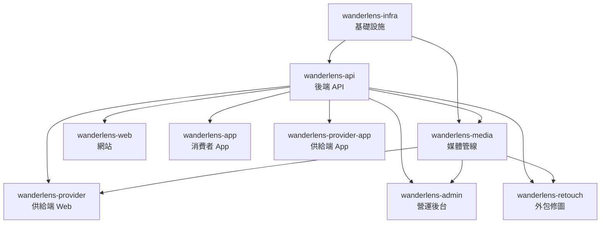

# WanderLens 專案拆分總規劃

> 本文件定義 WanderLens 平台的子專案拆分方案、職責邊界、技術棧、跨專案依賴與開發順序，作為所有子專案開發計畫的母文件。
>
> 建立日期：2026-06-23  
> 最後更新：**2026-06-27**（修訂版 A：根 README / docs 索引 / CI 歸位；子專案目錄未 rename）

---

## 1. 拆分原則

### 1.1 為什麼要拆分

WanderLens 不是一個單體應用，而是一個由**多個獨立產品端點 + 核心平台能力 + 媒體管線**構成的平台體系。拆分的原因：

1. **獨立擴展**：RAW 媒體管線的運算/儲存需求與訂單 API 完全不同
2. **獨立部署**：網站、App、攝影師端、後台的發布節奏不同
3. **團隊分工**：不同端點可由不同開發者/小組並行開發
4. **技術異質**：網站適合 SSR/SEO 框架，App 需原生或跨平台框架，媒體管線適合微服務
5. **階段化啟動**：App、外包修圖入口不需在階段一就存在

### 1.2 拆分依據

拆分依據來自 WanderLens 產品架構文件（01）的「產品端分工」：

| 端點 | 核心角色 | 對應子專案 |
|------|---------|-----------|
| 網站與 RWD | 獲客入口、SEO 內容池、首次下單轉換 | wanderlens-web |
| iOS/Android App | 內容留存與回訪引擎 | wanderlens-app |
| 攝影師/造型師端 | 供給管理與履約工具 | wanderlens-provider |
| 攝影師行動 App | 外出接單與履約 | wanderlens-provider-app |
| 營運後台 | 服務品質、供給、清算與客服控制台 | wanderlens-admin |
| 外包修圖入口 | 精修工單協作 | wanderlens-retouch |
| 核心平台能力 | 身分、預約、訂單、媒體管線、相簿、數據 | wanderlens-api + wanderlens-media |
| 基礎設施 | 部署、CI/CD、環境配置 | wanderlens-infra |

---

## 2. 子專案總覽

```
wanderlens/
├── README.md                    ← monorepo 總索引（2026-06-27）
├── docs/README.md               ← 平台文件分類索引（.md 實體仍在根目錄）
├── .github/workflows/           ← GitHub CI（正式位置）
├── e2e/                         ← Playwright 跨端測試
├── JS/                          ← joyshot 遺產（唯讀，見 JS/README.md）
├── 在地隨選攝影平台_商業企劃書.md    ← 企劃（根目錄；非 WanderLens_00）
├── WanderLens_01_完整產品架構文件.md          ← 產品架構（已存在）
├── WanderLens_02_使用者旅程與服務藍圖.md      ← 旅程藍圖（已存在）
├── WanderLens_03_內容與數據平台機制.md        ← 內容數據（已存在）
├── WanderLens_04_階段化產品路線.md            ← 產品路線（已存在）
├── WanderLens_05_前置研究與JS遺產盤點.md      ← JS 研究（已存在）
├── WanderLens_06_專案拆分總規劃.md            ← 本文件
├── WanderLens_07_UIUX設計規劃.md              ← UI/UX 設計系統（已存在）
├── WanderLens_08_開發盤點與CodeReview報告.md   ← 開發盤點與 Code Review（已存在）
│
├── wanderlens-api/              ← 後端 API（核心平台能力）
├── wanderlens-web/              ← 網站 RWD（獲客 + SEO + 首次下單）
├── wanderlens-app/              ← 消費者 App（iOS/Android，留存引擎）
├── wanderlens-provider/         ← 攝影師/造型師端 Web（供給管理 + 履約 + RAW 上傳）
├── wanderlens-provider-app/     ← 攝影師行動 App（接單 + 履約 + 訊息）
├── wanderlens-admin/            ← 營運後台（訂單監控 + 清算 + 客服）
├── wanderlens-media/            ← RAW/AI 媒體管線（獨立微服務）
├── wanderlens-retouch/          ← 外包修圖入口（階段二啟動）
└── wanderlens-infra/            ← 基礎設施（部署、CI/CD、環境配置）
```

---

## 3. 各子專案職責邊界

### 3.1 wanderlens-api（後端 API）

| 項目 | 內容 |
|------|------|
| **定位** | 平台核心後端，提供所有 REST API，處理認證、預約、訂單、金流、通知、溝通等業務邏輯 |
| **技術棧** | Java 17 + Spring Boot 3.x + MyBatis-Plus + MySQL + Redis |
| **Port** | 8080 |
| **JS 參考** | joyshot-api（27 Controller、40 Entity、35 Mapper） |
| **承擔** | 身分與權限、預約與媒合、訂單與狀態機、金流、站內溝通、相簿與內容管理、場景標籤、行為事件、清算帳本、排程任務 |
| **不承擔** | RAW 大檔案傳輸與 AI 調色運算（由 wanderlens-media 承擔）、前端 UI |

### 3.2 wanderlens-web（網站 RWD）

| 項目 | 內容 |
|------|------|
| **定位** | 獲客入口、SEO 內容池、首次下單轉換 |
| **技術棧** | Nuxt 3（Vue 3 + SSR + SSG） |
| **Port** | 3001（dev） |
| **JS 參考** | joyshot-app（首頁結構、搜尋列、攝影師列表、結帳流程） |
| **承擔** | 服務介紹、拍攝類型頁、公開作品頁、地點靈感頁、攝影師作品頁、預約流程、付款、網頁版相簿（過渡） |
| **不承擔** | 深度留存（App 職責）、RAW 上傳（provider 職責）、營運管理（admin 職責） |

### 3.3 wanderlens-app（消費者 App）

| 項目 | 內容 |
|------|------|
| **定位** | 內容留存與回訪引擎 |
| **技術棧** | React Native + Expo |
| **JS 參考** | 無（JS 無 App） |
| **承擔** | 相簿瀏覽、精修選片、分享、拍攝歷程、推播召回、再次預約、站內溝通 |
| **不承擔** | SEO 獲客（web 職責）、供給管理（provider 職責） |
| **啟動階段** | 已可本地 Expo Web / 裝置預覽；商店上架見 WanderLens_05 |

### 3.4 wanderlens-provider（攝影師/造型師端）

| 項目 | 內容 |
|------|------|
| **定位** | 供給管理與履約工具 |
| **技術棧** | Vue 3 + Element Plus |
| **Port** | 3002（dev） |
| **JS 參考** | joyshot-photographer（7 分頁結構、月曆 UI、服務地區 tree、作品集上傳） |
| **承擔** | 基本資料管理、檔期行事曆、服務地區、匯款資料、特色資料、作品集、評價查看、訂單履約（拍攝節點）、RAW 上傳、站內溝通室、收益查看 |
| **不承擔** | 後製調色（平台職責）、訂單管理（admin 職責） |
| **特殊** | RAW 上傳工具是此專案最重要的基礎設施，直接對接 wanderlens-media |

### 3.4.1 wanderlens-provider-app（攝影師行動 App）

| 項目 | 內容 |
|------|------|
| **定位** | 外出拍攝時的接單、履約、訊息與收益工具 |
| **技術棧** | React Native 0.74 + Expo SDK 51 |
| **Web 預覽** | 8081（Metro） |
| **JS 參考** | 無 |
| **承擔** | 接單模式（WebSocket）、訂單履約節點、行事曆瀏覽、SSE 訊息、收益摘要、推播 |
| **不承擔** | RAW 大檔上傳、檔期/作品集長表單（provider Web 職責） |
| **互補** | 與 `wanderlens-provider` 共用 API，分工「行動 vs 桌面」 |

### 3.5 wanderlens-admin（營運後台）

| 項目 | 內容 |
|------|------|
| **定位** | 服務品質、供給、清算與客服控制台 |
| **技術棧** | Vue 3 + Element Plus |
| **Port** | 3003（dev） |
| **JS 參考** | joyshot-admin（Dashboard、攝影師管理、訂單管理、優惠券、推廣員、區域管理） |
| **承擔** | 訂單監控、狀態機管理、RAW 驗收、AI 交付狀態、精修外包工單、攝影師審核、清算撥款、客服與爭議處理、站內溝通調閱、內容營運、數據後台 |
| **不承擔** | 消費者前台體驗、攝影師自助管理（provider 職責） |

### 3.6 wanderlens-media（RAW/AI 媒體管線）

| 項目 | 內容 |
|------|------|
| **定位** | RAW 上傳、儲存、AI 調色、交付管線（獨立微服務） |
| **技術棧** | Python FastAPI + Celery + 物件儲存（S3/GCS）+ AI 調色服務 |
| **Port** | 3004（dev） |
| **JS 參考** | 無（JS 用 Google Drive，完全需重建） |
| **承擔** | 大檔案分段上傳、斷點續傳、JPEG 快路徑、批次驗收、RAW 儲存、AI 基本調光調色、預覽圖產生、48h SLA 監控、失敗重試、儲存週期管理 |
| **不承擔** | 訂單業務邏輯（api 職責）、前端 UI（provider/admin 職責） |
| **獨立原因** | 大檔案傳輸需獨立頻寬、AI 運算需獨立擴展、與訂單 API 解耦避免拖垮核心 |

### 3.7 wanderlens-retouch（外包修圖入口）

| 項目 | 內容 |
|------|------|
| **定位** | 精修工單協作平台 |
| **技術棧** | Vue 3 + Element Plus（輕量） |
| **Port** | 3005（dev） |
| **JS 參考** | 無 |
| **承擔** | 接收工單、下載指定 RAW、上傳精修成品、回報狀態、規範文件查看 |
| **不承擔** | 訂單管理、金流、客戶溝通 |
| **啟動階段** | 階段二（初期可由 admin 後台 + 人工流程過渡，再獨立平台化） |

### 3.8 wanderlens-infra（基礎設施）

| 項目 | 內容 |
|------|------|
| **定位** | 部署、CI/CD、環境配置、基礎設施即代碼 |
| **技術棧** | Docker + Docker Compose（dev）+ Terraform/Bicep（prod）+ GitHub Actions |
| **JS 參考** | 無（JS 無基礎設施管理） |
| **承擔** | Docker Compose 環境、CI/CD pipeline、環境變數管理、API Gateway/反向代理、監控與日誌、物件儲存配置 |
| **不承擔** | 業務邏輯 |

---

## 4. 跨專案依賴關係



### 依賴說明

| 上游 | 下游 | 依賴內容 |
|------|------|---------|
| infra | 所有 | Docker 環境、CI/CD、反向代理 |
| api | media | 訂單/相簿狀態更新、驗收結果回報 |
| api | web | 所有 REST API |
| api | app | 所有 REST API |
| api | provider | 所有 REST API |
| api | provider-app | 所有 REST API + WebSocket/SSE |
| api | admin | 所有 REST API |
| media | provider | RAW 上傳端點（provider 直接對接 media） |
| media | admin | AI 狀態監控、驗收結果 |
| api | retouch | 精修工單 API |
| media | retouch | RAW 下載端點 |

---

## 5. 技術棧總覽

### 5.1 後端

| 技術 | 版本 | 用途 | 子專案 |
|------|------|------|--------|
| Java | 17+ | 語言 | api |
| Spring Boot | 3.x | 框架 | api |
| MyBatis-Plus | 3.5+ | ORM | api |
| MySQL | 8.0+ | 資料庫 | api |
| Redis | 7+ | 快取/鎖定 | api |
| Python FastAPI + Celery | - | 媒體管線 API + 任務佇列 | media |
| 物件儲存 | S3/GCS | RAW/JPEG 儲存 | media |

### 5.2 前端

| 技術 | 版本 | 用途 | 子專案 |
|------|------|------|--------|
| Vue 3 | 3.x | 核心框架 | web, provider, admin, retouch |
| Nuxt 3 | 3.x | SSR/SEO/SSG | web |
| Element Plus | 2.x | UI 元件庫 | provider, admin, retouch |
| React Native + Expo | - | 跨平台 App | app |
| Axios | 1.x | HTTP 客戶端 | 所有前端 |
| vue-i18n | 9.x | 多語系 | web, provider, admin |

### 5.3 基礎設施

| 技術 | 用途 | 子專案 |
|------|------|--------|
| Docker + Docker Compose | 開發環境 | infra |
| Nginx | 反向代理 | infra |
| GitHub Actions | CI/CD | infra |
| Terraform / Bicep | IaC（prod） | infra |

### 5.4 外部整合（沿用 JS 已驗證）

| 服務 | 用途 | 子專案 |
|------|------|--------|
| ECPay 綠界支付 | 線上付款 | api |
| LINE Notify | 通知 | api |
| Google Maps API | 地理服務 | api, web |
| Google Places API | 地點搜尋 | web |
| 三竹 SMS / Twilio | 簡訊 | api |
| SMTP Email | 郵件 | api |
| Meta Pixel / GA | 分析 | web |

---

## 6. 開發順序

### 6.1 階段一：服務驗證

```
Phase 1.0  wanderlens-infra    ← 環境基礎
Phase 1.1  wanderlens-api      ← 核心後端（所有端點的基礎）
Phase 1.2  wanderlens-web      ← 網站獲客 + 首次下單（依賴 api）
Phase 1.3  wanderlens-provider ← 攝影師端 + RAW 上傳（依賴 api + media）
Phase 1.4  wanderlens-media    ← RAW 管線 + AI 調色（可與 provider 並行）
Phase 1.5  wanderlens-admin    ← 營運後台（依賴 api + media）
```

### 6.2 階段二：服務完整化

```
Phase 2.1  wanderlens-api 擴展  ← 多供給池、精修工單、造型師時序
Phase 2.2  wanderlens-app       ← 消費者 App 啟動（留存引擎）
Phase 2.3  wanderlens-retouch   ← 外包修圖入口
Phase 2.4  各端點功能擴展
```

### 6.3 階段三～五

```
Phase 3    內容平台化（web SEO 內容池 + app 相簿 + 公開授權）
Phase 4    數據變現（聯盟行銷 + 場景推薦 + 數據後台）
Phase 5    跨境網絡（多語多幣 + 入境旅拍 + 海外供給）
```

---

## 7. 各子專案文件結構

每個子專案應包含以下文件：

```
wanderlens-{name}/
├── README.md                   ← 專案概覽（定位、技術棧、啟動方式）
├── DEVELOPMENT_PLAN.md         ← 開發計畫（階段、範圍、優先順序、成功判準）
├── TASK_PLAN.md                ← Task 清單（含 ID、描述、依賴、估時、狀態）
├── ARCHITECTURE.md             ← 技術架構（模組設計、資料流、與其他專案的關係）
├── API_SPEC.md                 ← API 規格（如適用）
├── DATA_MODEL.md               ← 資料模型（如適用）
└── src/                        ← 原始碼（開發時建立）
```

### 文件定義

| 文件 | 內容 |
|------|------|
| **README.md** | 專案定位、技術棧、環境需求、啟動指令、與其他專案的關係 |
| **DEVELOPMENT_PLAN.md** | 開發階段、各階段範圍、優先順序、成功判準、風險 |
| **TASK_PLAN.md** | Task ID、標題、描述、依賴 Task、預估工時、狀態（todo/in-progress/done）、對應階段 |
| **ARCHITECTURE.md** | 模組設計、分層架構、資料流、外部整合、與其他子專案的介面 |
| **API_SPEC.md** | REST 端點、請求/回應格式、認證、錯誤碼（api 專案專用） |
| **DATA_MODEL.md** | Entity 定義、欄位、關聯、索引、Migration（api 專案專用） |

---

## 8. Task ID 命名規範

### 8.1 Task ID 格式

```
{專案代碼}-{階段}-{流水號}

範例：
API-1-001    ← wanderlens-api 階段一 第 001 號 task
WEB-1-005    ← wanderlens-web 階段一 第 005 號 task
MED-1-003    ← wanderlens-media 階段一 第 003 號 task
```

### 8.2 專案代碼

| 代碼 | 子專案 |
|------|--------|
| INF | wanderlens-infra |
| API | wanderlens-api |
| WEB | wanderlens-web |
| APP | wanderlens-app |
| PRV | wanderlens-provider |
| ADM | wanderlens-admin |
| MED | wanderlens-media |
| RTU | wanderlens-retouch |

### 8.3 Task 狀態

| 狀態 | 說明 |
|------|------|
| 🔲 todo | 尚未開始 |
| 🔄 in-progress | 進行中 |
| ✅ done | 已完成 |
| ⛔ blocked | 被阻塞（需註明阻塞原因） |

---

## 9. 跨專案協調機制

### 9.1 API 契約優先

`wanderlens-api` 的 API 規格是所有前端專案的契約。開發順序：

1. api 定義 API 規格（API_SPEC.md）
2. 各前端專案依 API 規格開發
3. api 實作 API
4. 前端對接

### 9.2 資料模型集中管理

`wanderlens-api` 的 DATA_MODEL.md 是全平台的資料模型唯一來源。其他專案引用但不重複定義。

### 9.3 環境配置集中管理

`wanderlens-infra` 統一管理所有子專案的環境變數、Docker Compose、CI/CD pipeline。

---

## 10. 風險與注意事項

| 風險 | 對策 |
|------|------|
| API 規格變更影響所有前端 | API 版本化 + 變更通知機制 |
| 跨專案依賴導致阻塞 | api 優先完成核心 API，前端可先用 mock 開發 |
| 媒體管線與 API 的介面不清 | 明確定義 media 的 API 契約 |
| 多專案環境配置不一致 | infra 統一管理環境變數 |
| 階段一範圍蔓延 | 嚴格遵守階段一 MVP 範圍，不提前做 App/retouch |

---

*文件建立日期：2026-06-23*